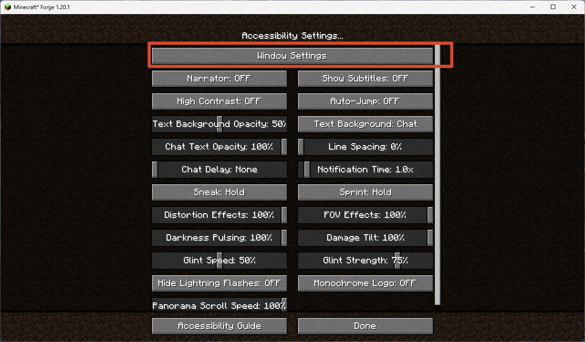
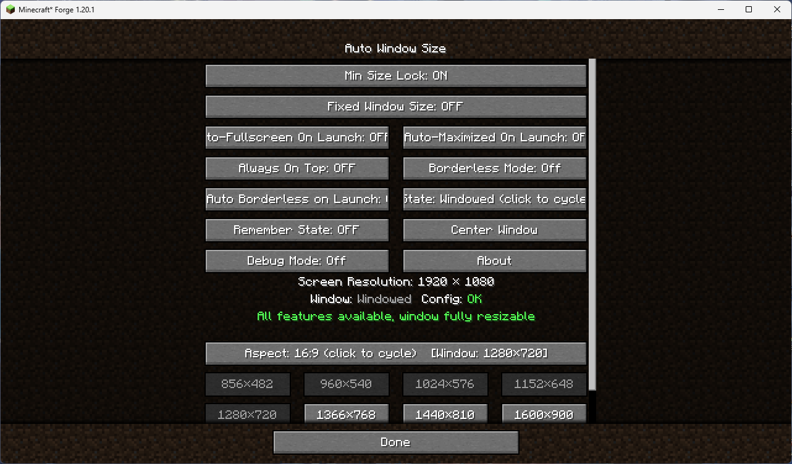
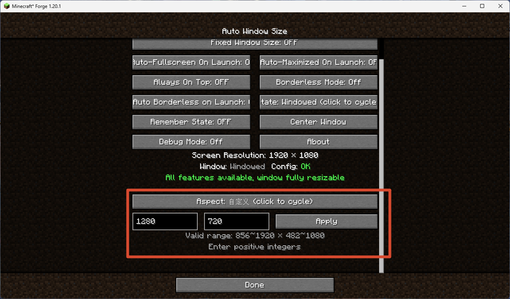
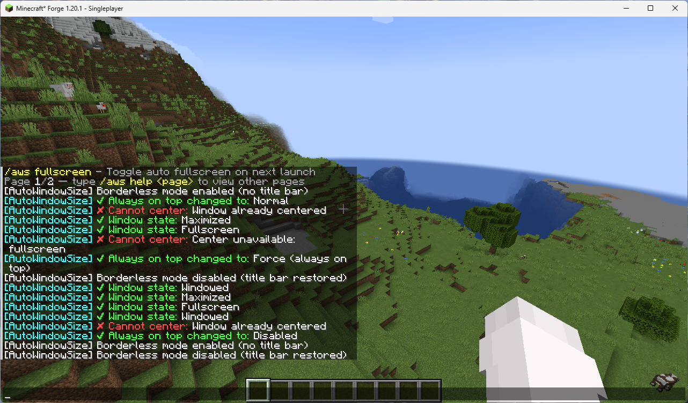
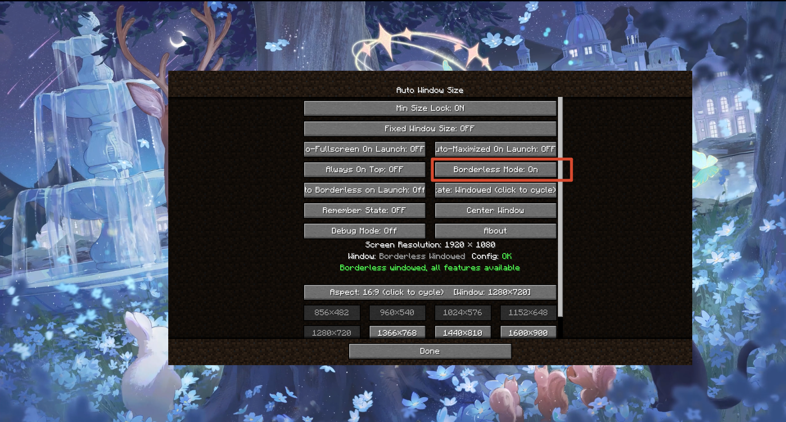
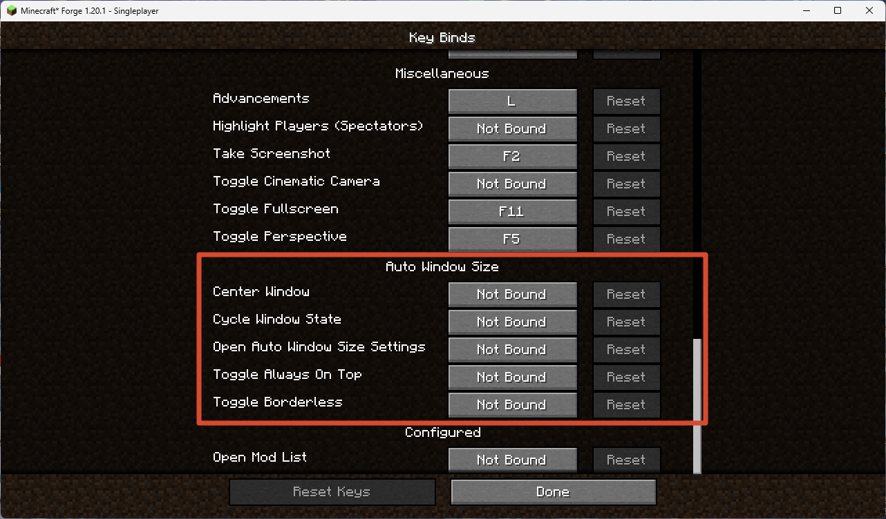
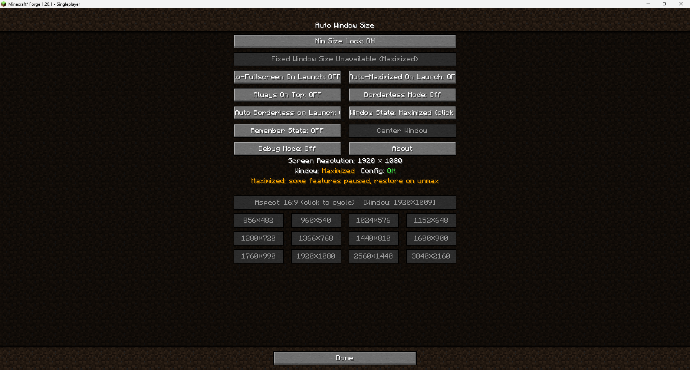

# Auto Window Size

> A Minecraft 1.20.1 / Forge client-side mod — auto window sizing, centering, minimum-size lock, fixed window size, borderless mode, always-on-top, and auto-fullscreen on launch.

> **⚠ Platform notice: this mod only supports desktop Minecraft (Windows / macOS / Linux). It does not work on mobile / Bedrock.**

> **📮 About the source: the author is new to GitHub / Git and once caused some messy repository state during an update. If the source you downloaded does not match the released jar, email 3270728922@qq.com for the correct source.**

[中文](README_ZH-CN.md)

---

## What it does

When building a modpack you spend ages arranging mod GUIs exactly right — then a player launches on a different resolution, the window resizes, and every layout breaks. Auto Window Size turns "game window size" from a lucky accident into a deliberate choice: on launch it sizes the window to your resolution and centers it, can lock a minimum size, fully freeze the window size, center it in one click, and even start fullscreen. It only touches the OS-level window and almost never conflicts with other mods.

- **Auto window sizing on launch**: after a configurable delay (default 1.5s) it sets the window to your configured resolution (default 1280×720) and centers it, without stretching the loading screen.
- **Resolution presets**: grouped by aspect ratio (16:9 / 16:10 / 4:3 / 5:4 / 21:9) with 12 one-click presets per ratio, plus a custom resolution input; presets larger than your screen, smaller than the configured minimum, or matching the current size are auto-disabled.
- **Minimum size lock**: the window can grow freely but cannot shrink below the configured size, keeping tuned UI layouts intact.
- **Fixed window size**: freezes the window at its current size; the maximize button is disabled at the OS level, so a "fake maximized" state is impossible.
- **Center window**: one-click centering on whichever monitor the window is on.
- **Borderless mode**: removes the window title bar and borders; works in windowed, maximized, and fullscreen (pseudo-fullscreen) states.
- **Always-on-top**: three modes — off, normal (GLFW floating), and force (re-claims focus every frame, can override other always-on-top windows like classroom monitoring software).
- **Auto-fullscreen / auto-maximize / auto-borderless on launch**: players can persistently toggle "start fullscreen", "start maximized", or "start borderless" on next launch; modpack authors can set a one-time onboarding flag.
- **Window position memory**: optionally save and restore the window position and size across launches instead of forcing center; compatible with auto-fullscreen / auto-maximize.
- **Cycle window state**: one button / keybind to cycle through windowed → maximized → fullscreen.
- **Native entry point**: a "Window Settings" button in Options → Accessibility Settings (moved from Video Settings to stay compatible with mods like Embeddium that replace the video settings screen).
- **Client-side only**, no server install; works out of the box at 1280×720.

<strong>📸 Screenshots</strong> (click to expand — 7 images)

 

**1. Settings entry** — Options → Accessibility Settings → Window Settings

**2. Main settings screen** — all toggles, info area, and 16:9 resolution presets

**3. Custom resolution input** — width/height fields with live validation and range hint

**4. In-game commands** — `/aws help` pagination and command feedback in chat

**5. Key bindings** — 5 configurable keybinds in Options → Controls

**6. Borderless mode** — window title bar and borders removed

**7. Maximized state** — relevant buttons auto-disabled with yellow status hint

---

## Quick Start

1. Install Minecraft 1.20.1 with Forge (47.x or newer).
2. Drop `autowindowsize-1.1.0.jar` into your `.minecraft/mods/` folder.
3. Launch the game. The window will automatically resize to 1280×720 and center after 1.5 seconds.
4. Open **Options → Accessibility Settings → Window Settings** to configure everything.

---

## Usage

### Opening the settings screen

Go to **Options → Accessibility Settings**, then click the **Window Settings** button at the top of the list.

### Core features at a glance

| Feature | What it does |
|---------|-------------|
| Auto window size | On launch, sets the window to your configured resolution and centers it |
| Minimum size lock | Prevents the window from being resized below the configured minimum |
| Fixed window size | Completely locks the window size (maximize button disabled at OS level) |
| Center window | One-click centering on the current monitor |
| Borderless mode | Removes window decorations (title bar + borders) |
| Always-on-top | Keeps the window above other windows (3 modes) |
| Remember position | Saves/restores window position and size across launches |
| Resolution presets | 60 presets across 5 aspect ratios, plus custom input |
| Cycle state | Cycles windowed → maximized → fullscreen |

> 💡 **Tip**: Hover over any button in the settings screen for a detailed tooltip explaining what it does.

---

## Commands

All commands use the `/aws` prefix. Type `/aws help` in-game for the full list with pagination.

| Command | Description |
|---------|-------------|
| `/aws help [page]` | Show the command list (2 pages, 8 commands per page) |
| `/aws gui` | Open the Window Settings screen |
| `/aws status` | Show current window state, config status, and resolution |
| `/aws toggle` | Toggle minimum size lock on/off |
| `/aws lock` | Enable minimum size lock |
| `/aws unlock` | Disable minimum size lock |
| `/aws fixed` | Toggle fixed window size on/off |
| `/aws center` | Center the window on the current monitor |
| `/aws fullscreen` | Toggle fullscreen on/off |
| `/aws maximize` | Toggle maximized on/off |
| `/aws remember` | Toggle window position memory on/off |
| `/aws top` | Cycle always-on-top mode (off → normal → force) |
| `/aws debug` | Toggle debug logging on/off |
| `/aws borderless [auto]` | Toggle borderless mode; `auto` subcommand toggles auto-borderless on launch |
| `/aws resolution [ratio] <width> <height>` | Set window resolution; supports ratio+preset (e.g. `16:9 1920x1080`) or custom width/height |

> 💡 **Tip**: `/aws resolution` supports tab-completion. Type a ratio (e.g. `16:9`) and press Tab to see available presets.

---

## Key Bindings

All keybinds are **unbound by default**. Set them in **Options → Controls → Auto Window Size**.

| Keybind | Default | Description |
|---------|---------|-------------|
| Open Window Settings | None | Open the Window Settings screen |
| Center Window | None | Center the window on the current monitor |
| Toggle Borderless | None | Toggle borderless mode on/off |
| Cycle Window State | None | Cycle windowed → maximized → fullscreen |
| Toggle Always-on-Top | None | Cycle always-on-top mode (off → normal → force) |

> 💡 All keybinds give chat feedback when pressed (e.g. "Window centered", "Borderless mode enabled").

---

## Config Files

All config files live in **`.minecraft/config/AutoWindowSize/`**:

| File | Purpose |
|------|---------|
| `config.toml` | Main configuration (window size, lock, auto-fullscreen, etc.) |
| `window.json` | Saved window position/size (only used when "Remember position" is enabled) |

### Main config options (`config.toml`)

| Option | Default | Range | Description |
|--------|---------|-------|-------------|
| `windowWidth` | 1280 | 856–7680 | Default window width on launch |
| `windowHeight` | 720 | 482–4320 | Default window height on launch |
| `startupDelay` | 1.5 | 0.5–10.0 | Seconds to wait before applying window size on launch |
| `autoFullscreen` | false | — | Start in fullscreen on next launch |
| `autoMaximize` | false | — | Start maximized on next launch |
| `autoBorderless` | false | — | Start in borderless mode on next launch |
| `lockEnabled` | false | — | Enable minimum size lock |
| `fixedEnabled` | false | — | Enable fixed window size |
| `rememberPosition` | false | — | Save/restore window position and size |
| `alwaysOnTopMode` | 0 | 0–2 | Always-on-top mode (0=off, 1=normal, 2=force) |
| `borderless` | false | — | Enable borderless mode |
| `debug` | false | — | Enable debug logging |

> 💡 You can also edit these in-game via a config-screen mod (e.g. Configured, Cloth Config). Config option names and tooltips follow the game language.

---

## Downloads

> **Prefer GitHub Releases.** Other platforms (CurseForge / Modrinth / MC Baike / MCBBS / BBSMC / KLBBS / HIMCBBS) may lag behind by a few days due to review or sync delays.

- **GitHub Releases (always latest, recommended)**: https://github.com/3270728922/AutoWindowSize/releases
- **CurseForge**: https://www.curseforge.com/minecraft/mc-mods/auto-window-size
- **Modrinth**: https://modrinth.com/mod/autowindowsize
- **MC Baike**: https://www.mcmod.cn/class/30769.html
- **MCBBS**: https://www.mcbbs.co/thread-6322-1-1.html
- **BBSMC**: https://bbsmc.net/mod/autowindowsize
- **KLBBS**: https://klpbbs.com/thread-173769-1-1.html
- **HIMCBBS**: https://www.himcbbs.com/resources/1499/

## Notes

- **When upgrading this mod, manually delete the old config folder**: `.minecraft/config/AutoWindowSize/` (and the old `.minecraft/config/autowindowsize-client.toml` if upgrading from pre-1.0.9). Due to changes in config entries and file layout, Forge won't rewrite an existing file; deleting it and launching generates a fresh one. Client-side only; desktop Minecraft (Windows/macOS/Linux), not mobile.

## Wiki

Detailed feature explanations, design decisions, and troubleshooting live in the **Wiki**:

- **English Wiki**: [WIKI.md](WIKI.md)
- **中文 Wiki**: [WIKI_ZH-CN.md](WIKI_ZH-CN.md)

## Feedback

- **Issues / Bug reports**: https://github.com/3270728922/AutoWindowSize/issues
- **Discussions**: https://github.com/3270728922/AutoWindowSize/discussions
- **Author email**: 3270728922@qq.com

---

## Latest: v1.1.0

- **Borderless mode**: removes window title bar and borders; supports windowed, maximized, and fullscreen (pseudo-fullscreen) states; auto-borderless on launch option.
- **Always-on-top**: three modes — off, normal (GLFW floating), and force (re-claims focus every frame, can override other always-on-top windows).
- **Window state cycle button**: one click to cycle windowed → maximized → fullscreen.
- **5 keybinds**: Open Settings, Center, Toggle Borderless, Cycle State, Toggle Always-on-Top (all unbound by default, with chat feedback).
- **About page**: in-game info screen with mod purpose, usage, downloads, feedback, and author info (20 languages).
- **Settings entry moved** to **Accessibility Settings** (compatible with Embeddium and other mods that replace the video settings screen).
- **15 commands** total: added `/aws borderless`, `/aws top`, `/aws debug`, `/aws gui`, `/aws status`, `/aws toggle`; `/aws help` now has pagination (2 pages, 8 commands per page).
- **Resolution presets**: presets smaller than the configured minimum are now auto-disabled (in addition to larger-than-screen and matching-current).
- **Custom resolution input**: live validation with hover tooltip showing valid range; apply button disabled when input is invalid.
- **Config files** unified in `config/AutoWindowSize/` (config.toml + window.json); config screen supports 20 languages.
- **20 languages** supported.
- Various bug fixes: scroll position preservation, button highlight overflow, aspect ratio sync, preset disabling logic, window state detection in borderless mode, and more.

Full changelog: [CHANGELOG.md](CHANGELOG.md) · [CHANGELOG_ZH-CN.md](CHANGELOG_ZH-CN.md)
