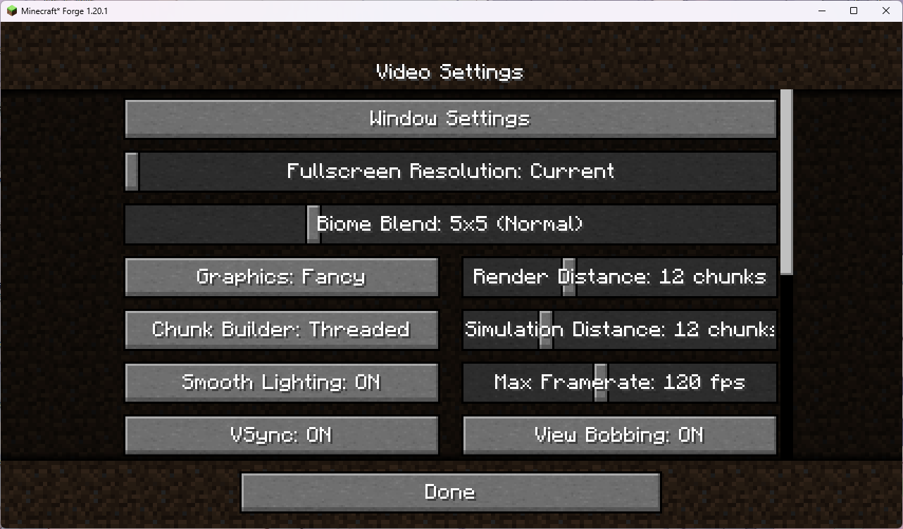
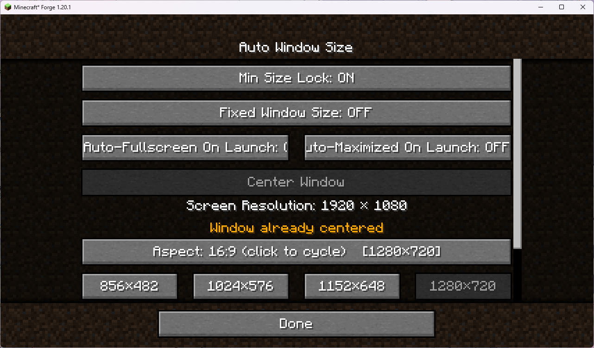

# Auto Window Size

> A Minecraft 1.20.1 / Forge client-side mod — auto window sizing, centering, minimum-size lock, fixed window size and auto-fullscreen on launch.

> **⚠ Platform notice: this mod only supports desktop Minecraft (Windows / macOS / Linux). It does not work on mobile / Bedrock.**

> **📮 About the source: the author is new to GitHub / Git and once caused some messy repository state during an update. If the source you downloaded does not match the released jar, email 3270728922@qq.com for the correct source.**

[中文](README_ZH-CN.md)

---

## What it does

When building a modpack you spend ages arranging mod GUIs exactly right — then a player launches on a different resolution, the window resizes, and every layout breaks. Auto Window Size turns "game window size" from a lucky accident into a deliberate choice: on launch it sizes the window to your resolution and centers it, can lock a minimum size, fully freeze the window size, center it in one click, and even start fullscreen. It only touches the OS-level window and almost never conflicts with other mods.

- **Auto window sizing on launch**: after a ~1.5 s delay it sets the window to your configured resolution (default 1280×720) and centers it, without stretching the loading screen.
- **Resolution presets**: grouped by aspect ratio (16:9 / 16:10 / 4:3 / 5:4 / 21:9) with one-click common resolutions, plus a custom resolution input; presets larger than your screen are auto-disabled.
- **Minimum size lock**: the window can grow freely but cannot shrink below the configured size, keeping tuned UI layouts intact.
- **Fixed window size**: freezes the window at its current size; the maximize button is disabled at the OS level, so a "fake maximized" state is impossible.
- **Center window**: one-click centering on whichever monitor the window is on.
- **Auto-fullscreen / auto-maximize on launch**: players can persistently toggle "start fullscreen" or "start maximized" on next launch (mutually exclusive); modpack authors can set a one-time onboarding flag so the first launch enters fullscreen or maximized once.
- **Native entry point**: a "Window Settings" button injected into Options → Video Settings.
- **Client-side only**, no server install; works out of the box at 1280×720.

Full details, command list, config options and FAQ live in the **Wiki**.

---

## Downloads

> **Prefer GitHub Releases.** Other platforms (CurseForge / Modrinth / MC Baike / MCBBS / BBSMC / KLBBS / HIMCBBS) may lag behind by a few days due to review or sync delays.

- **GitHub Releases (always latest, recommended)**: https://github.com/3270728922/AutoWindowSize/releases
- **CurseForge**: https://www.curseforge.com/minecraft/mc-mods/auto-window-size
- **Modrinth**: https://modrinth.com/mod/autowindowsize
- **MC Baike**: https://www.mcmod.cn/class/30769.html
- **MCBBS**: https://www.mcbbs.co/thread-6322-1-1.html
- **BBSMC**: https://bbsmc.net/mod/autowindowsize
- **KLBBS**: https://klpbbs.com/thread-173769-1-1.html
- **HIMCBBS**: https://www.himcbbs.com/resources/1499/

## Notes

- **When upgrading this mod, manually delete the old config file**: `.minecraft/config/autowindowsize-client.toml`. Due to changes in config comments and entries, Forge won't rewrite an existing file; deleting it and launching generates a fresh one. Client-side only; desktop Minecraft (Windows/macOS/Linux), not mobile.

## Wiki

- **English Wiki**: [WIKI.md](WIKI.md)
- **中文 Wiki**: [WIKI_ZH-CN.md](WIKI_ZH-CN.md)

## Feedback

- **Issues / Bug reports**: https://github.com/3270728922/AutoWindowSize/issues
- **Author email**: 3270728922@qq.com

---

## Latest: v1.0.8

- Added resolution presets in the Window Settings screen, grouped by aspect ratio (16:9 / 16:10 / 4:3 / 5:4 / 21:9). Click a preset to apply it immediately, center the window and save to config.
- Aspect ratio switches via a cycle button showing "current → next".
- Presets larger than the current screen are auto-disabled.
- The settings screen now uses the vanilla scrolling list (AbstractSelectionList) with a scrollbar and top/bottom fade, matching the vanilla video options screen.
- Screen resolution is polled live, so changing the OS display resolution updates the settings screen automatically.

Full changelog: [CHANGELOG.md](CHANGELOG.md) · [CHANGELOG_ZH-CN.md](CHANGELOG_ZH-CN.md)
