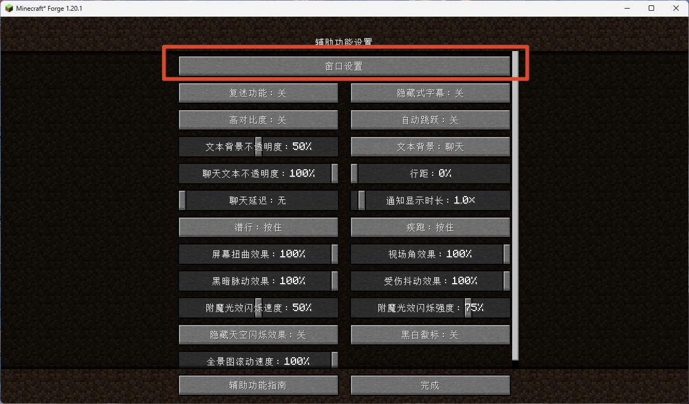
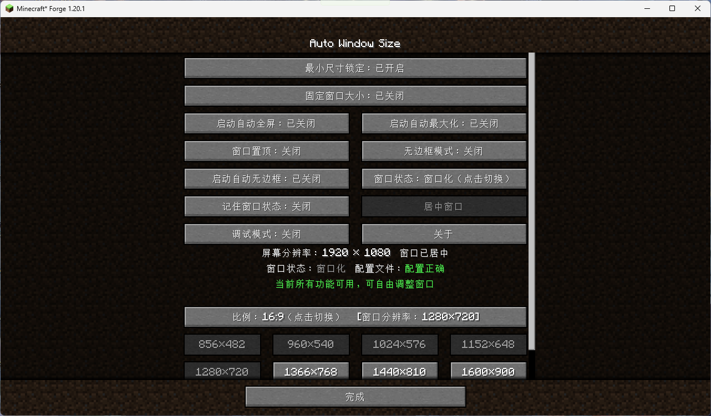
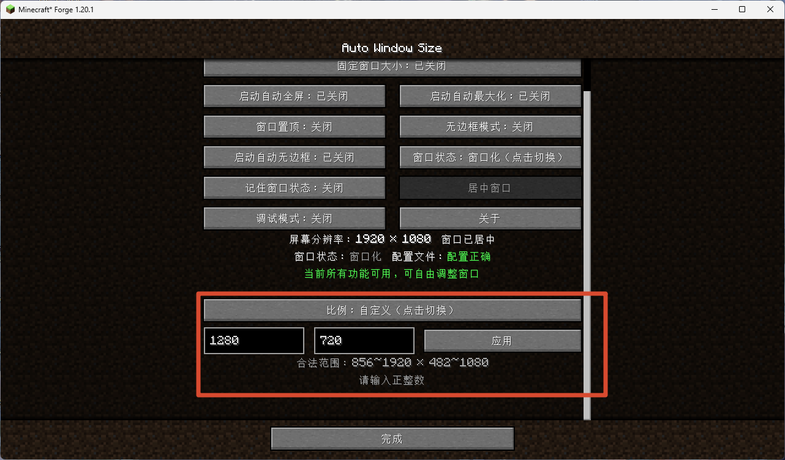
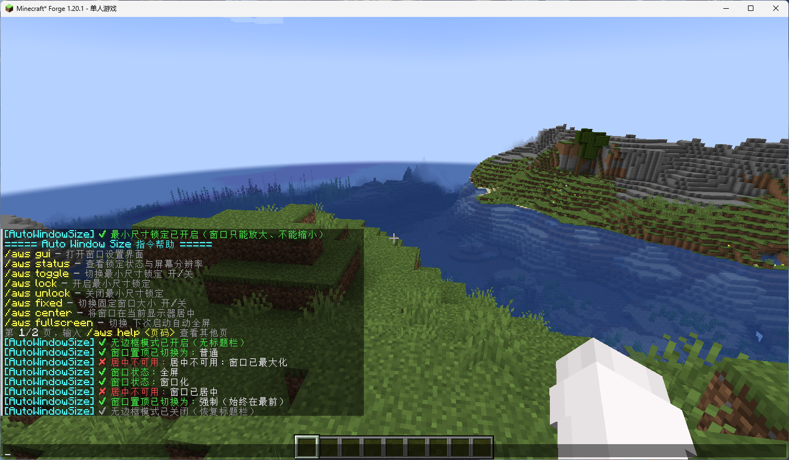
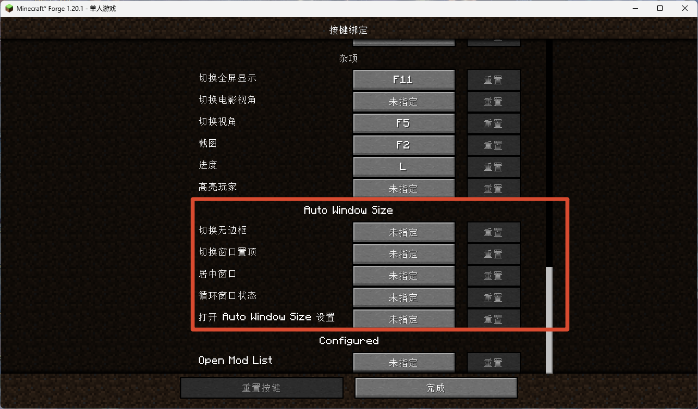
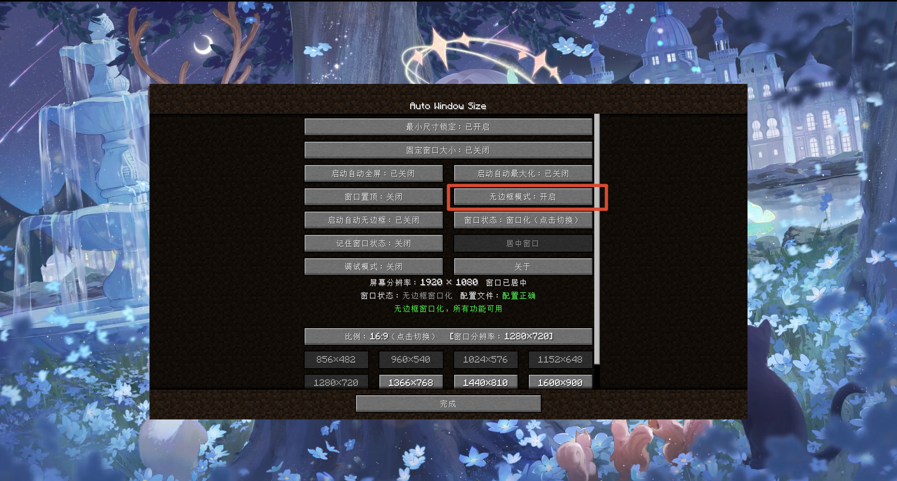
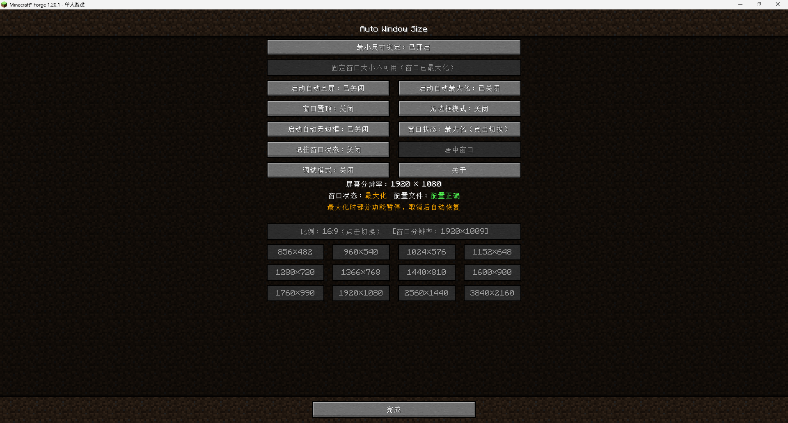

# Auto Window Size

> Minecraft 1.20.1 / Forge 纯客户端模组 — 自动窗口大小、居中、最小尺寸锁定、固定窗口大小、无边框模式、三档窗口置顶、窗口状态循环、5个快捷键、128个分辨率预设（8种比例×16个），以及启动自动全屏/最大化/无边框

> **⚠ 平台提示：本模组仅支持桌面版 Minecraft（Windows / macOS / Linux），不支持手机版（基岩版 / 手机端）。Windows 已充分测试；macOS / Linux 为实验性支持，无边框模式、窗口置顶和窗口状态检测可能存在边界问题。**

> **📮 关于源码：作者是 GitHub / Git 新手，早期仓库更新曾出现过操作失误导致文件混乱。如果你下载到的源码与实际发布的 jar 对不上，请发邮件至 jujuawa@qq.com 获取正确源码。**

[English](README.md)

---

## 这是什么

在整合包里把各模组 UI 一点点调好后，玩家换个分辨率启动，窗口一变、布局全乱。Auto Window Size 把"游戏窗口大小"从偶然变成可控的选择：启动后自动按指定分辨率把窗口设好并居中，还能锁定最小尺寸、彻底固定窗口大小、一键居中、下次启动自动全屏，几乎不碰游戏内逻辑，不和别的模组冲突。

- **启动自动设窗口**：启动后延迟可配置（默认1.5秒），把窗口设为配置分辨率（默认 1280×720）并居中，不拉伸加载界面。
- **分辨率预设**：按宽高比（16:9 / 16:10 / 4:3 / 5:4 / 21:9 / 3:2 / 2:1 / 9:16）分组，共8种比例，每种16个常用分辨率一键切换，也支持自定义分辨率输入；超过屏幕、低于配置最小值（锁定开启时）或匹配当前大小的预设自动禁用。
- **最小尺寸锁定**：窗口只能放大、不能缩小到配置值以下，保护调好的 UI。
- **固定窗口大小**：把当前窗口大小完全锁死，最大化按钮在系统层禁用，从根上杜绝"假最大化"。
- **居中窗口**：一键把窗口在它所在的显示器居中。
- **无边框模式**：去除窗口标题栏和边框；支持窗口化、最大化和全屏（伪全屏）三种状态。
- **窗口置顶**：三种模式 — 关闭、普通（GLFW 悬浮）、强制（每帧重新抢焦点，可覆盖教室监控软件等其他置顶窗口）。
- **启动自动全屏 / 自动最大化 / 自动无边框**：玩家可在设置里持久勾选"下次启动自动全屏"、"自动最大化"或"自动无边框"；整合包作者也可在配置里设一次性引导。
- **窗口位置记忆**：可选择退出时保存窗口位置与大小，下次启动恢复（而非强制居中）；与自动全屏/最大化兼容。
- **循环切换窗口状态**：一个按钮/快捷键即可在 窗口化 → 最大化 → 全屏 之间循环切换。
- **辅助功能设置原生入口**：在「选项 → 辅助功能设置」里插一个「窗口管理与分辨率设置」按钮（从视频设置迁移，兼容 Embeddium 等替换视频设置界面的模组）。
- **纯客户端**，不需要装在服务端；默认 1280×720 即装即用。

<strong>📸 截图展示</strong>（点击展开 — 共7张）

 

**1. 设置入口** — 选项 → 辅助功能设置 → 窗口设置

**2. 设置主界面** — 所有开关、信息区和16:9分辨率预设

**3. 自定义分辨率输入** — 宽/高输入框，带实时校验和范围提示

**4. 游戏内指令** — `/aws help` 分页输出和指令聊天反馈

**5. 快捷键绑定** — 选项 → 控制中可配置的5个快捷键

**6. 无边框模式** — 窗口标题栏和边框已去除

**7. 最大化状态** — 相关按钮自动禁用，黄色状态提示

---

## 快速开始

1. 安装 Minecraft 1.20.1 与 Forge（47.x 或更高版本）。
2. 将 `AutoWindowSize-1.20.1-1.1.2.jar` 放入 `.minecraft/mods/` 文件夹。
3. 启动游戏。1.5秒后窗口会自动调整为 1280×720 并居中。
4. 打开 **选项 → 辅助功能设置 → 窗口管理与分辨率设置** 进行所有配置。

---

## 使用说明

### 打开设置界面

进入 **选项 → 辅助功能设置**，点击列表顶部的 **窗口管理与分辨率设置** 按钮。

### 核心功能一览

| 功能 | 说明 |
|------|------|
| 启动自动设窗口 | 启动后按配置分辨率设置窗口大小并居中 |
| 最小尺寸锁定 | 防止窗口被缩小到配置最小值以下 |
| 固定窗口大小 | 完全锁定窗口大小（最大化按钮在系统层禁用） |
| 居中窗口 | 一键在当前显示器上居中窗口 |
| 无边框模式 | 去除窗口装饰（标题栏+边框） |
| 窗口置顶 | 保持窗口在其他窗口之上（3种模式） |
| 记住窗口状态 | 跨启动保存/恢复窗口位置和大小 |
| 分辨率预设 | 8种比例共128个预设（8种比例×16个），外加自定义输入 |
| 循环切换状态 | 在 窗口化 → 最大化 → 全屏 之间循环 |

> 💡 **提示**：在设置界面中将鼠标悬停在任意按钮上，可查看该功能的详细说明。

---

## 指令

所有指令均以 `/aws` 开头。在游戏内输入 `/aws help` 可查看分页的完整指令列表。

| 指令 | 说明 |
|------|------|
| `/aws help [页码]` | 显示指令列表（共3页，每页8条） |
| `/aws gui` | 打开窗口管理与分辨率设置界面 |
| `/aws about` | 打开关于页面 |
| `/aws info` | 显示详细的窗口、配置和分辨率信息 |
| `/aws version` | 显示模组版本信息 |
| `/aws config` | 打开配置文件夹 |
| `/aws status` | 显示当前窗口状态和最小尺寸锁定状态 |
| `/aws toggle [true/false]` | 切换最小尺寸锁定；可加 `true`/`false` 明确开启/关闭 |
| `/aws fixed [true/false]` | 切换固定窗口大小；可加 `true`/`false` |
| `/aws center` | 在当前显示器上居中窗口 |
| `/aws fullscreen [true/false]` | 切换全屏；可加 `true`/`false` |
| `/aws maximize [true/false]` | 切换最大化；可加 `true`/`false` |
| `/aws remember [true/false]` | 切换窗口位置记忆；可加 `true`/`false` |
| `/aws top [off/normal/force]` | 切换窗口置顶模式；可加状态名直接选择 |
| `/aws debug [true/false]` | 切换调试日志；可加 `true`/`false` |
| `/aws borderless [true/false]` | 切换无边框模式；可加 `true`/`false` |
| `/aws borderless auto [true/false]` | 切换启动自动无边框；可加 `true`/`false` |
| `/aws resolution [比例] <预设>` | 设置窗口分辨率并居中；支持比例+预设（如 `16:9 1920x1080`），Tab 自动补全 |

> 💡 **提示**：`/aws resolution` 支持 Tab 自动补全。输入比例（如 `16:9`）后按 Tab 可查看可用预设。

---

## 快捷键

所有快捷键**默认未绑定**。在 **选项 → 控制 → Auto Window Size** 中设置。

| 快捷键 | 默认 | 说明 |
|--------|------|------|
| 打开窗口设置 | 无 | 打开窗口设置界面 |
| 居中窗口 | 无 | 在当前显示器上居中窗口 |
| 切换无边框 | 无 | 切换无边框模式开/关 |
| 循环切换窗口状态 | 无 | 在 窗口化 → 最大化 → 全屏 之间循环 |
| 切换窗口置顶 | 无 | 循环切换窗口置顶模式（关闭→普通→强制） |

> 💡 所有快捷键按下时都会在聊天框给出反馈（如"窗口已居中"、"无边框模式已开启"）。

---

## 配置文件

所有配置文件位于 **`.minecraft/config/AutoWindowSize/`** 目录下：

| 文件 | 用途 |
|------|------|
| `config.toml` | 主配置（窗口大小、锁定、自动全屏等） |
| `window.json` | 保存的窗口位置/大小（仅在开启"记住窗口状态"时使用） |

### 主配置选项（`config.toml`）

| 选项 | 默认值 | 范围 | 说明 |
|------|--------|------|------|
| `configVersion` | 1 | 1–999 | 内部配置版本号，用于自动迁移。请勿手动修改。 |
| `windowWidth` | 1280 | 856–7680 | 启动时默认窗口宽度 |
| `windowHeight` | 720 | 482–4320 | 启动时默认窗口高度 |
| `startupDelay` | 1.5 | 0.5–10.0 | 启动后等待多少秒再应用窗口大小 |
| `autoFullscreen` | false | — | 下次启动自动进入全屏 |
| `autoMaximize` | false | — | 下次启动自动最大化 |
| `autoBorderless` | false | — | 下次启动自动开启无边框 |
| `lockEnabled` | false | — | 开启最小尺寸锁定 |
| `fixedEnabled` | false | — | 开启固定窗口大小 |
| `rememberPosition` | false | — | 保存/恢复窗口位置和大小 |
| `alwaysOnTopMode` | 0 | 0–2 | 窗口置顶模式（0=关闭，1=普通，2=强制） |
| `borderless` | false | — | 开启无边框模式 |
| `debug` | false | — | 开启调试日志 |

> 💡 你也可以通过配置界面模组（如 Configured、Cloth Config）在游戏内修改这些选项。配置名称和描述会随游戏语言切换。
>
> 🔄 **配置自动迁移**：从 v1.1.1 开始，升级时模组会在首次启动时自动检测并迁移旧配置文件，无需手动删除配置文件夹。进入世界后聊天框会提示迁移完成。

---

## 下载

> **建议优先从 GitHub Releases 下载**，其他平台（CurseForge / Modrinth / MC 百科 / MCBBS / BBSMC / 苦力怕论坛 / HIMCBBS）可能因审核或同步延迟，版本会比 GitHub 慢几天。

- **GitHub Releases（推荐，始终最新）**：https://github.com/3270728922/AutoWindowSize/releases
- **CurseForge**：https://www.curseforge.com/minecraft/mc-mods/auto-window-size
- **Modrinth**：https://modrinth.com/mod/autowindowsize
- **MC 百科**：https://www.mcmod.cn/class/30769.html
- **MCBBS**：https://www.mcbbs.co/thread-6322-1-1.html
- **BBSMC**：https://bbsmc.net/mod/autowindowsize
- **苦力怕论坛（KLBBS）**：https://klpbbs.com/thread-173769-1-1.html
- **HIMCBBS**：https://www.himcbbs.com/resources/1499/

## 注意事项

- **配置自动迁移（v1.1.1起）**：升级时模组会在首次启动自动检测并迁移旧配置，无需手动删除配置文件夹，进入世界后聊天框会提示迁移完成。如果是从 1.0.9 之前版本升级，旧的 `autowindowsize-client.toml` 会被检测到并在日志中警告（可手动删除）。本模组为纯客户端模组，仅支持桌面版 Minecraft，不支持手机版。

## Wiki

详细的功能说明、设计决策和故障排除请见 **Wiki**：

- **中文 Wiki**：[WIKI_ZH-CN.md](WIKI_ZH-CN.md)
- **English Wiki**: [WIKI.md](WIKI.md)

## 反馈

- **问题反馈 / 提 Bug**：https://github.com/3270728922/AutoWindowSize/issues
- **讨论区**：https://github.com/3270728922/AutoWindowSize/discussions
- **作者邮箱**：jujuawa@qq.com

---

## 最新版本：v1.1.2

- **更多预设**：新增 3 个比例（3:2、2:1、9:16 竖屏），现在共 8 个比例，每个比例 16 个预设（共 128 个）。
- **比例按钮拆分为三段**：左/右箭头 + 中间信息显示（当前比例+实时窗口分辨率），点错了不用再绕一圈。
- **指令大改**：新增 4 个指令（`/aws about`、`/aws info`、`/aws version`、`/aws config`）；全部切换指令支持 `true`/`false` 参数；`/aws top` 支持 `off`/`normal`/`force` 直接选模式；移除冗余的 `/aws lock`/`/aws unlock`。
- **回车快速应用**：在自定义分辨率输入框按回车即可立即应用，无需点击应用按钮。
- **关于页面改进**：可点击链接（URL 打开浏览器，邮箱复制到剪贴板）、滚动位置恢复、3 倍滚动速度。
- **界面优化**：设置入口改名为"窗口管理与分辨率设置"，按钮状态文字统一（开启/关闭），悬停提示优化并使用手动换行。
- **Bug 修复**：关闭锁定时预设禁用逻辑、输入框焦点丢失、语言文件 JSON 解析错误、全新安装时配置迁移误报。

### 上一个版本：v1.1.1

- **配置自动迁移**：升级时再也不用手动删配置了！模组会在首次启动自动检测旧配置版本并迁移，进入世界后聊天框提示迁移完成。
- **修复许可证**：根目录 `LICENSE.txt` 现在是真正的 MIT 许可证文本（之前是 Forge MDK 的 LGPL 模板），GitHub 能正确识别许可证了。
- **包名规范化**：从 `com.example.autowindowsize`（Forge MDK 模板残留）改为 `com.jujumlqwq.autowindowsize`。
- **修正作者信息**：所有地方的作者名统一为 `JujuMLQwQ, ML`，联系邮箱改为 `jujuawa@qq.com`。

### 更早版本：v1.1.0

- **无边框模式**：去除窗口标题栏和边框；支持窗口化、最大化和全屏（伪全屏）三种状态；新增启动自动无边框选项。
- **窗口置顶**：三种模式 — 关闭、普通（GLFW 悬浮）、强制（每帧重新抢焦点，可覆盖其他置顶窗口）。
- **循环切换窗口状态按钮**：一键在 窗口化 → 最大化 → 全屏 之间循环切换。
- **5个快捷键**：打开设置、居中、切换无边框、循环状态、切换置顶（默认未绑定，带聊天反馈）。
- **关于页面**：游戏内信息页面，包含模组目的、使用方法、下载渠道、反馈渠道和作者信息（20种语言）。
- **设置入口迁移**到**辅助功能设置**（兼容 Embeddium 等完全替换视频设置界面的模组，避免按钮消失）。
- **共15个指令**：新增 `/aws borderless`、`/aws top`、`/aws debug`、`/aws gui`、`/aws status`、`/aws toggle`；`/aws help` 现在支持分页（共2页，每页8条）。
- **分辨率预设**：低于配置最小值的预设现在也会自动禁用（除了超过屏幕和匹配当前大小之外）。
- **自定义分辨率输入**：实时校验，鼠标悬停显示合法范围；输入非法值时应用按钮禁用。
- **配置文件**统一到 `config/AutoWindowSize/` 目录（config.toml + window.json）；配置界面支持20种语言。
- **支持20种语言**。
- 修复大量 bug：滚动位置保持、按钮高亮溢出、比例同步、预设禁用逻辑、无边框模式下窗口状态检测等。

完整更新日志：[CHANGELOG_ZH-CN.md](CHANGELOG_ZH-CN.md) · [CHANGELOG.md](CHANGELOG.md)
