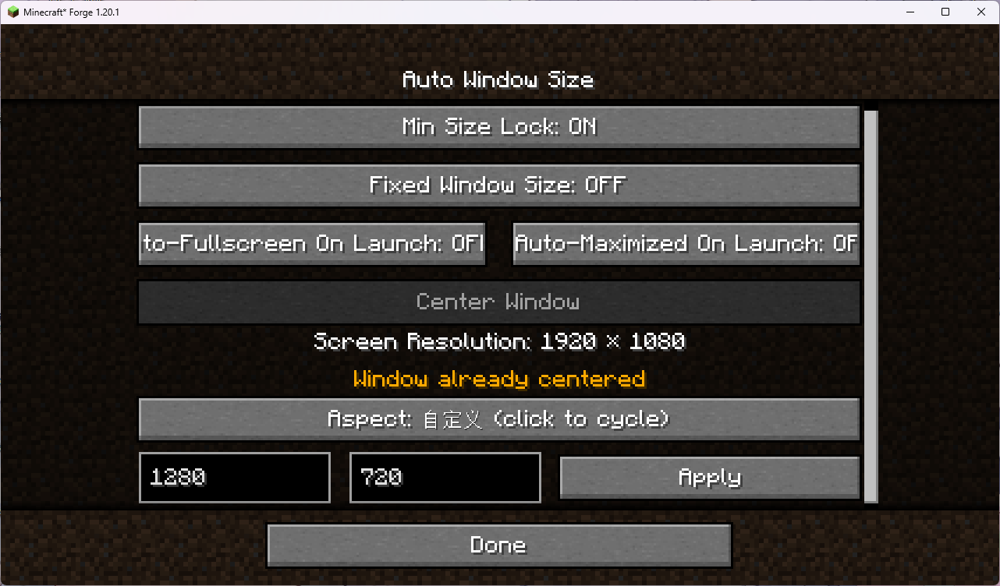
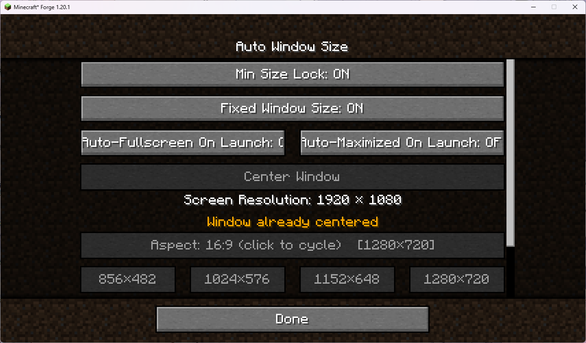

# Auto Window Size · English Wiki

> A Minecraft 1.20.1 / Forge client-side mod — auto window sizing, centering, minimum-size lock, fixed window size and auto-fullscreen on launch.

> **⚠ Platform notice: this mod only supports desktop Minecraft (Windows / macOS / Linux). It does not work on mobile / Bedrock.**

> **📮 About the source: the author is new to GitHub / Git and once caused some messy repository state during an update. If the source you downloaded does not match the released jar, email 3270728922@qq.com for the correct source.**





[中文 Wiki](WIKI_ZH-CN.md) · [Back to README](README.md)

---

## Downloads

- **GitHub Releases**: https://github.com/3270728922/AutoWindowSize/releases
- **CurseForge**: https://www.curseforge.com/minecraft/mc-mods/auto-window-size
- **Modrinth**: https://modrinth.com/mod/autowindowsize
- **MC Baike**: https://www.mcmod.cn/class/30769.html
- **MCBBS**: https://www.mcbbs.co/thread-6322-1-1.html
- **BBSMC**: https://bbsmc.net/mod/autowindowsize
- **KLBBS**: https://klpbbs.com/thread-173769-1-1.html
- **HIMCBBS**: https://www.himcbbs.com/resources/1499/

## Feedback

- **Issues / Bug reports**: https://github.com/3270728922/AutoWindowSize/issues
- **Author email**: 3270728922@qq.com

---

## Table of contents

- [Why it exists](#why-it-exists)
- [Features](#features)
- [The three toggles at a glance](#the-three-toggles-at-a-glance)
- [Resolution priority](#resolution-priority)
- [Lock & fixed behaviour](#lock--fixed-behaviour)
- [Auto-fullscreen on launch](#auto-fullscreen-on-launch)
- [Too-low resolution detection](#too-low-resolution-detection)
- [Fullscreen behaviour](#fullscreen-behaviour)
- [Commands](#commands)
- [Status message on world join](#status-message-on-world-join)
- [Window Settings screen](#window-settings-screen)
- [Installation](#installation)
- [Config file](#config-file)
- [Key binding](#key-binding)
- [Multi-monitor support](#multi-monitor-support)
- [Technical details](#technical-details)
- [FAQ](#faq)
- [Changelog](#changelog)
- [Acknowledgements](#acknowledgements)

---

## Why it exists

When building a modpack, you spend a lot of time arranging GUIs exactly right — then a player launches on a different resolution, the window resizes, and every layout breaks. This mod takes control of that one variable: it turns "game window size" from a lucky accident into a deliberate, repeatable, constrained choice.

### Core goal

- **Stable modpack experience**: window size becomes something the author can plan for, instead of being left to the player's launch habits.
- **Protect UI layouts**: the minimum-size lock keeps any tuned interface from being dragged out of place.
- **Lightweight and non-invasive**: it only touches the OS-level window itself, not any in-game mechanism or gameplay logic, so it almost never conflicts with other mods.
- **Works out of the box, yet configurable**: a default of 1280×720, plus config file, in-game buttons, keybind and commands.

### Design trade-offs

- **Only the window, nothing in-game**: no GUI scale changes, no in-game UI changes, no gameplay hooks.
- **Delayed on purpose**: it waits ~1.5 s after launch so the loading screen is never stretched.
- **Low hard floor**: the minimum resolution is hardcoded to 856×482 (16:9) so older monitors still work.
- **Graceful fallback, no crash**: if the configured size exceeds the screen, it silently disables the lock and explains in chat.
- **No keybind by default**: it never fights your existing keybinds.

### Who it's for

- Modpack authors who need mod UIs to look consistent across resolutions.
- Players who like playing in a small window but fear dragging it too small.
- Multi-monitor users who want the window centered on the right screen.

### Future plans

This is the author's first Minecraft mod, so it stays focused for now:

- Currently maintained and tested only on Minecraft 1.20.1 / Forge.
- Priority is stability, polish and documentation before any port.
- Once proven stable, ports to other versions or loaders (NeoForge, Fabric, etc.) may follow.
- Later it may explore the direction of **True Window** and **Window Control** — true borderless fullscreen, window-mode switching, resolution presets and per-window monitor selection. These are plans only; no timeline is promised.

---

## Features

- **Auto window sizing on launch**: after a ~1.5 s delay it sets the window to the configured resolution and centers it.
- **Minimum size lock**: grow as big as you like, never shrink below the configured resolution.
- **Fixed window size**: freezes the window at its current size (min = max = size at toggle time). No jump to the config value, no forced recenter. The maximize button is disabled at the OS level (GLFW_RESIZABLE=false), so a "fake maximized" state is impossible; the toggle itself is disabled while maximized or fullscreen. Fullscreen still works and returns to the fixed size on exit.
- **Center window button**: centers the window on its current monitor in one click; disabled with a reason while fullscreen, maximized, minimized or already centered.
- **Auto-fullscreen / auto-maximize on launch**: players can persistently toggle "start fullscreen" or "start maximized" on next launch (mutually exclusive); modpack authors can set a one-time onboarding flag for the first launch.
- **Native entry point**: a "Window Settings" button injected right below the Fullscreen Resolution row in Video Settings.
- **Window Settings screen**: toggles for minimum-size lock / fixed window size / auto-fullscreen-on-next-launch, a center button, and live screen/window resolution (yellow and labeled when fullscreen).
- **Client commands**: `/aws toggle`, `lock`, `unlock`, `status`, `gui`, `center`, `fixed`.
- **Fullscreen support**: the lock and fixed size are suspended in fullscreen and restored on exit.
- **Custom keybind**: opens the Window Settings screen (unbound by default).
- **Too-low resolution fallback**: only the minimum-size lock is disabled; fixed size, centering and auto-fullscreen keep working.
- **A short chat status message every time you enter a world.**
- **Live resolution readout**: updates 0.5 s after you stop dragging.
- **Multi-monitor aware**.

---

## The three toggles at a glance

- **Minimum size lock = a lower bound only.** The window can grow freely but cannot shrink below the configured size.
- **Fixed window size = the whole size is frozen.** The current size becomes the only size (min = max = current). It does not jump to the config value and does not force-recenter; it just locks "the size right now".
- **Auto-fullscreen on next launch = a startup preference.** It does not change the current window; it only remembers that the next launch should start in fullscreen.

When minimum-size lock and fixed window size are both on, fixed wins. Auto-fullscreen on next launch does not conflict with either.

| State | Min-size lock | Fixed size | Center | Auto-fullscreen next launch |
|-------|---------------|------------|--------|-----------------------------|
| Normal window | ✔ | ✔ | ✔ | ✔ |
| Config resolution too large | ✘ | ✔ | ✔ | ✔ |
| Maximized | ✔ | ✘ | ✘ | ✔ |
| Minimized | per state | per state | ✘ | ✔ |
| Fullscreen | temporarily ✘ | temporarily ✘ | ✘ | ✔ |
| Already centered | ✔ | ✔ | ✘ (already) | ✔ |

---

## Resolution priority

```
Hardcoded minimum (856×482)
        ↓
Config value (default 1280×720)
        ↓
Player manual dragging (only when the lock is off)
```

| Priority | Source | Default | Note |
|----------|--------|---------|------|
| 1 (highest) | Hardcoded | 856×482 | Wired into the code; never below it |
| 2 | Config file | 1280×720 | Read at launch from `config/autowindowsize-client.toml` |
| 3 (lowest) | Player drag | — | Only when the minimum-size lock is off |

The config lower bound is bound to the hardcoded minimum, so you can never configure a value smaller than the mod actually supports.

---

## Lock & fixed behaviour

### When the minimum-size lock is on

- The minimum window size is locked to the config value (≥ 856×482).
- The window can be enlarged freely, with no upper limit.
- It cannot be shrunk below the locked size.
- Exiting fullscreen re-applies the limit if it was on before.

### When the minimum-size lock is off

- The window is fully resizable.
- No minimum-size limit is applied.

### When fixed window size is on

- The current window size is frozen (min = max = the size at toggle time).
- Neither resizing nor maximizing is possible; the maximize button is disabled at the OS level.
- It never jumps to the config value and never forces a recenter.
- Fullscreen (F11) still works and returns to the fixed size on exit.


### When features are disabled

- **Resolution too low**: only the minimum-size lock is disabled; fixed size and centering keep working.
- **Fullscreen**: lock and fixed size are suspended, restored on exit.
- **Maximized**: fixed size is disabled (un-maximize first) so a "fullscreen-sized" window is never locked.

---

## Auto-fullscreen / auto-maximize on launch

New in v1.0.7. It works on two levels. **Auto-fullscreen and auto-maximize are mutually exclusive (pick one)**: in the UI, enabling one greys out the other; in the config, if both guide targets are true, neither takes effect and both reset to false.

### Player level: start fullscreen / maximized next launch

In the Window Settings screen, click "Auto-fullscreen on next launch" or "Auto-maximized on next launch" to toggle the preference. It does **not** change the current window — it only remembers your choice so that **the next launch** starts in fullscreen or maximized. The two are mutually exclusive: enabling fullscreen greys out the maximize button and vice versa. The choice is persisted in the config file.

### Modpack-author level: one-time onboarding

If you are making a modpack and want players to enter fullscreen or maximized on first launch (and afterwards let them decide), set in `config/autowindowsize-client.toml` under `[startup]`:

- `applyStartupGuide = true`;
- `startFullscreen = true` (fullscreen) or `startMaximized = true` (maximized) — **not both**;
- ship this config with the pack.

On the player's first launch, the mod follows the guide target, syncs the player's matching in-game preference to it, and then **automatically writes `applyStartupGuide` back to `false`**. From then on it only follows the player's own in-game setting. If you mistakenly set both `startFullscreen` and `startMaximized` to `true`, neither applies this launch and both reset to `false`.

> **The guide yields to an existing player preference**: if the player already enabled auto-fullscreen or auto-maximized before opening the pack (i.e. `autoFullscreen` / `autoMaximized` is already true), the pack's guide is ignored, and the mod automatically writes `applyStartupGuide`, `startFullscreen` and `startMaximized` all back to `false`, then starts per the player's own preference. The one-time guide only ever applies to a brand-new player with no startup preference set.

> **Both-true fallback**: whether from the guide layer or the player-preference layer, if `autoFullscreen` and `autoMaximized` are both true (e.g. edited by hand), neither applies this launch and both are reset to `false`, so the two in-game buttons never stay mutually blocked.

> Auto-fullscreen on launch: exiting fullscreen with F11 afterwards returns the window to the config resolution and centers it; auto-maximize on launch: clicking restore does the same. Manual F11 toggles mid-game still restore the window to its pre-fullscreen position.

> Author workflow note: when you test on your dev machine, `applyStartupGuide` becomes `false` after one launch. **Set it back to `true` before packaging the modpack**, or players won't get the onboarding.

> Safe by default: `applyStartupGuide` defaults to `false`. A player installing the mod alone is never forced into fullscreen or maximized.

---

## Too-low resolution detection

### Trigger

If **any** of the following holds, the minimum-size lock is auto-disabled:

```
config width  > screen width
config height > screen height
hardcoded min width (856)  > screen width
hardcoded min height (482) > screen height
```

### After trigger

1. The window size is left untouched.
2. No GLFW size limits are applied.
3. `lockDisabled = true`.
4. A red chat message explains the reason when entering a world.
5. The lock button is greyed out.
6. Related commands and keybinds are blocked with a reason.

> Fixed size, centering and auto-fullscreen are **not** affected by this (they don't depend on the config resolution).

### Recovery

Set the config resolution to a value ≤ the screen resolution and restart the game. The check runs once at launch.

---

## Fullscreen behaviour

Entering fullscreen (F11):

- The minimum-size lock and fixed window size are suspended, regardless of their current state.
- Their pre-fullscreen states are remembered.
- A red chat message notes that they will restore on exit.
- The corresponding buttons are greyed out.

Exiting fullscreen (F11):

- Minecraft itself restores the window to its pre-fullscreen size/position; the mod does not force any size.
- If the lock was on, it is re-applied.
- If fixed size was on, it is re-applied.
- If the lock was permanently disabled by a too-low resolution, nothing is changed.

---

## Commands

All commands start with `/aws` (client-side, in-game only):

| Command | Description |
|---------|-------------|
| `/aws toggle` | Toggle the minimum-size lock |
| `/aws lock` | Enable the minimum-size lock |
| `/aws unlock` | Disable the minimum-size lock |
| `/aws status` | Show current lock state and screen resolution |
| `/aws gui` | Open the Window Settings screen |
| `/aws center` | Center the window on its monitor (with reason if unavailable) |
| `/aws fixed` | Toggle fixed window size |

When the lock is disabled (too-low resolution or fullscreen), related commands show a red reason.

---

## Status message on world join

Each time you enter a world, the chat shows one message about the current lock state:

| State | Color |
|-------|-------|
| Lock on | Green |
| Lock off | Gray |
| Resolution too low | Red |
| Fullscreen | Red |

---

## Window Settings screen

### How to open

1. Main menu: `Options…` → `Video Settings…` → `Window Settings`.
2. In-game: `Esc` → `Options…` → `Video Settings…` → `Window Settings`.
3. Press your bound key (unbound by default).
4. Chat: `/aws gui`.

### Contents

| Element | Description |
|---------|-------------|
| Screen resolution | Current monitor resolution (e.g. 1920 × 1080), white |
| Window resolution | Current window size (e.g. 1280 × 720), light green; yellow + "(Fullscreen)" when fullscreen |
| Min Size Lock button | Toggle; greyed with a reason when disabled |
| Fixed Window Size button | Freeze current size; greyed when maximized/fullscreen |
| Auto-fullscreen next launch button | Toggle the persistent preference; mutually exclusive with auto-maximize |
| Auto-maximized next launch button | Toggle the persistent preference; mutually exclusive with auto-fullscreen |
| Center Window button | Center on the current monitor |
| Aspect ratio button | Cycles through 16:9 / 16:10 / 4:3 / 5:4 / 21:9; shows "current → next" |
| Resolution preset buttons | 4 per row, grouped by aspect; click to apply instantly and center; presets larger than the screen are disabled |
| Done button | Back to Video Settings |

### Resolution presets

- Groups: 16:9 (856×482 / 1280×720 / 1366×768 / 1600×900 / 1920×1080 / 2560×1440), 16:10 (1280×800 / 1440×900 / 1680×1050 / 1920×1200), 4:3 (800×600 / 1024×768 / 1280×960 / 1600×1200), 5:4 (1280×1024 / 1600×1280), 21:9 (2560×1080 / 3440×1440).
- Click a preset to switch window resolution, center it, and write it back to the config.
- Presets larger than the current screen are auto-disabled.
- The screen resolution is re-checked live; changing the system resolution updates the enabled state automatically.

While dragging the window edge the numbers stay frozen with an orange hint; 0.5 s after release they refresh.

---

## Installation

1. Install Minecraft 1.20.1 and Forge 47.x.
2. Drop the jar into `.minecraft/mods`.
3. Launch the game.

> Client-side only; no server install needed.

---

## Config file

```
.minecraft/config/autowindowsize-client.toml
```

```toml
[window]
# width / height: startup window size, also the lower bound when the lock is on.
# width range 856 ~ 7680, default 1280; height range 482 ~ 4320, default 720.

[startup]
# One-time onboarding flag (modpack authors). When true, this launch follows
# startFullscreen / startMaximized, syncs the player preference, then writes this back to false.
applyStartupGuide = false
# Only used when applyStartupGuide is true: whether this first launch starts fullscreen.
# Mutually exclusive with startMaximized.
startFullscreen = false
# Only used when applyStartupGuide is true: whether this first launch starts maximized.
# Mutually exclusive with startFullscreen.
startMaximized = false
# Player preference: start in fullscreen on next launch (toggle in the in-game UI). Mutually exclusive with autoMaximized.
autoFullscreen = false
# Player preference: start maximized on next launch (toggle in the in-game UI). Mutually exclusive with autoFullscreen.
autoMaximized = false
```

Comments are bilingual (English above, Chinese below), with a blank comment line above each option and an "author / player" split inside [startup]. Range is added by Forge.

- **When upgrading this mod, delete the old config file** `.minecraft/config/autowindowsize-client.toml` first. Due to changes in config comments and entries, Forge won't rewrite an existing file; deleting it and launching generates a fresh one.
- The config is read at launch; editing it while running requires a restart. (The in-game toggles persist immediately.)
- The lower bounds are bound to the hardcoded minimum, so you can never configure a smaller value.
- If the config resolution exceeds the screen, the lock is auto-disabled.

---

## Key binding

Unbound by default. Bind it via `Options…` → `Controls…` → search "Auto Window Size" → "Open Window Settings".

---

## Multi-monitor support

- The mod detects which monitor the window is currently on (by its center).
- It centers on that monitor, not always the primary one.
- If the window center spans two monitors, the primary monitor is used.

---

## Technical details

| Item | Value |
|------|-------|
| Minecraft | 1.20.1 |
| Forge | 47.x |
| Mod ID | `autowindowsize` |
| Type | Client-side |
| Hardcoded minimum resolution | 856×482 (16:9) |
| Default resolution | 1280×720 |
| License | MIT |
| Language | Java |

---

## FAQ

**Q: Why didn't the window change after I edited the config resolution?**
A: If the config resolution is larger than your screen, the lock is disabled and the window is left alone. Set it ≤ your screen resolution and restart.

**Q: Can I still make the window bigger with the lock on?**
A: Yes. The lock only limits the minimum size.

**Q: What's the difference between the minimum-size lock and fixed window size?**
A: The lock is a lower bound (grow, not shrink). Fixed size freezes the window at its current size (min = max = current; maximize button disabled). With both on, fixed wins.

**Q: Why doesn't "auto-fullscreen on next launch" fullscreen me right now?**
A: It is a startup preference for the **next** launch, not an immediate toggle. Press F11 to fullscreen now.

**Q: How do I make my modpack open in fullscreen on first launch?**
A: Set `applyStartupGuide = true` and `startFullscreen = true` under `[startup]` and ship that config. The player's first launch goes fullscreen once, then the flag clears itself. Make sure it is still `true` when you package.

**Q: Does it need to be on the server?**
A: No. Purely client-side.

**Q: Does it conflict with other mods?**
A: It only changes window size and size limits, not in-game mechanics, so conflicts are unlikely.

---

## Changelog

Full changelog (history, latest expanded by default):
[CHANGELOG (English)](CHANGELOG.md) · [CHANGELOG_ZH-CN.md](CHANGELOG_ZH-CN.md)

---

## Acknowledgements

- **JujuMLQwQ** — developer
- **ML** — contributor

### Inspiration

- **Fixed window size** was inspired by [Locked Window Size](https://modrinth.com/mod/locked-window-size) (LGPL-3.0). This mod is an **independent implementation** using only the public GLFW API (`GLFW_RESIZABLE`); it does not copy any source and stays MIT licensed. Thanks to the original author.
- **Auto-fullscreen on launch** draws on the idea of launching into a chosen window mode in [Window Control](https://www.curseforge.com/minecraft/mc-mods/window-control) (independent implementation, no copied code).
- Future borderless-fullscreen / window-mode-switch directions reference [True Window](https://www.curseforge.com/minecraft/mc-mods/true-window) and [Window Control](https://www.curseforge.com/minecraft/mc-mods/window-control) (independent implementations).

Thanks to every player and modpack author using this mod. Feedback is welcome on [Issues](https://github.com/3270728922/AutoWindowSize/issues).
