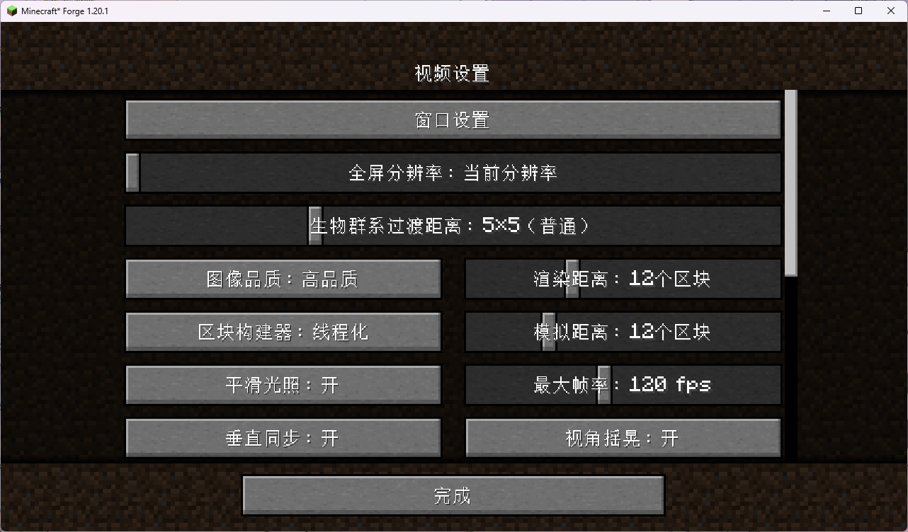
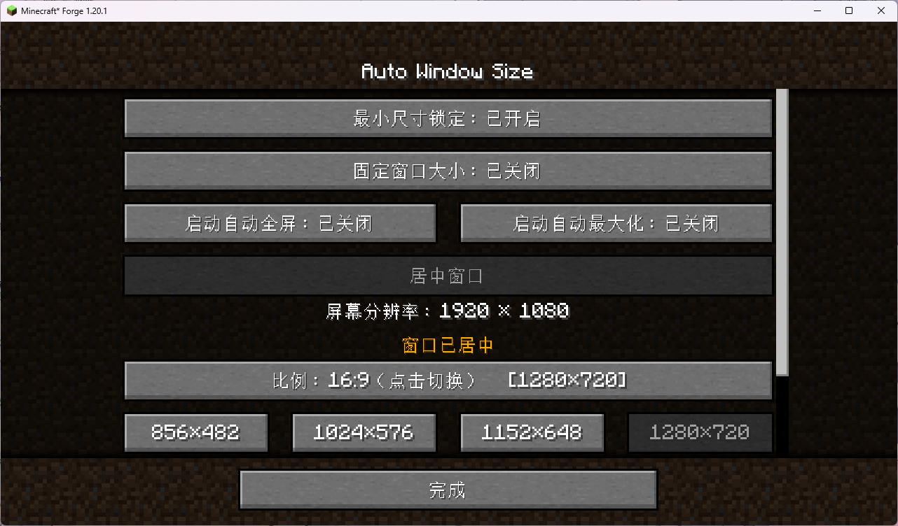
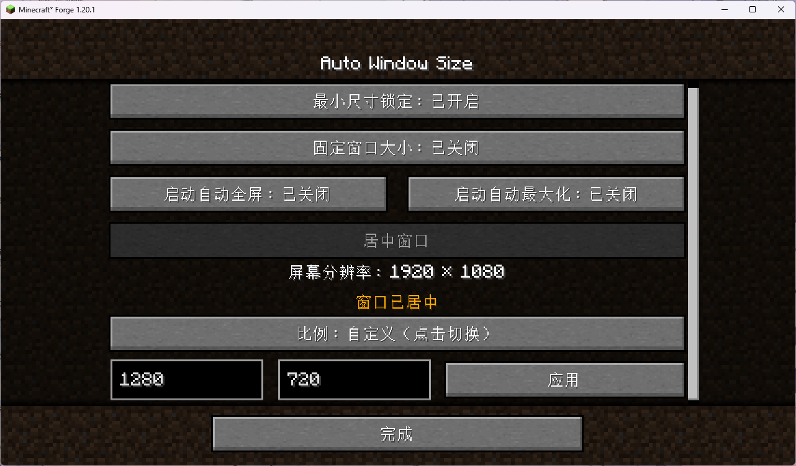
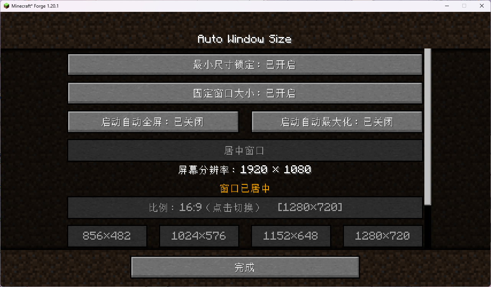

# Auto Window Size · 中文 Wiki

> Minecraft 1.20.1 / Forge 纯客户端模组 | 自动窗口大小、居中、最小尺寸锁定、固定窗口大小、启动自动全屏

> **⚠ 平台提示：本模组仅支持桌面版 Minecraft（Windows / macOS / Linux），不支持手机版（基岩版 / 手机端）。**

> **📮 关于源码：作者是 GitHub / Git 新手，早期仓库更新曾出现过操作失误导致文件混乱。如果你下载到的源码与实际发布的 jar 对不上，请发邮件至 3270728922@qq.com 获取正确源码。**






[English Wiki](WIKI.md) · [返回 README](README_ZH-CN.md)

---

## 下载

- **GitHub Releases**：https://github.com/3270728922/AutoWindowSize/releases
- **CurseForge**：https://www.curseforge.com/minecraft/mc-mods/auto-window-size
- **Modrinth**：https://modrinth.com/mod/autowindowsize
- **MC 百科**：https://www.mcmod.cn/class/30769.html
- **MCBBS**：https://www.mcbbs.co/thread-6322-1-1.html
- **BBSMC**：https://bbsmc.net/mod/autowindowsize
- **苦力怕论坛（KLBBS）**：https://klpbbs.com/thread-173769-1-1.html
- **HIMCBBS**：https://www.himcbbs.com/resources/1499/

## 反馈

- **问题反馈 / 提 Bug**：https://github.com/3270728922/AutoWindowSize/issues
- **作者邮箱**：3270728922@qq.com

---

## 目录

- [制作目的](#制作目的)
- [功能特性](#功能特性)
- [三个开关的区别](#三个开关的区别)
- [分辨率优先级](#分辨率优先级)
- [锁定与固定机制详解](#锁定与固定机制详解)
- [启动自动全屏](#启动自动全屏)
- [分辨率过低检测](#分辨率过低检测)
- [全屏行为](#全屏行为)
- [指令](#指令)
- [进游戏状态提示](#进游戏状态提示)
- [窗口设置界面](#窗口设置界面)
- [安装方法](#安装方法)
- [配置文件](#配置文件)
- [键位绑定](#键位绑定)
- [多显示器支持](#多显示器支持)
- [技术信息](#技术信息)
- [常见问题](#常见问题)
- [更新日志](#更新日志)
- [致谢与灵感来源](#致谢与灵感来源)

---

## 制作目的

在制作整合包时，我经常遇到这样的问题：好不容易把各个模组的 UI 界面布局调试好了，结果玩家换了一个分辨率启动游戏，窗口大小变了，所有 UI 布局全乱了。

为了解决这个问题，我做了这个模组：启动时自动把窗口设置为指定大小并居中，同时提供最小尺寸锁定，确保整合包的 UI 布局在不同玩家的电脑上都能保持一致。

### Mod 核心目的

这个模组存在的根本理由，是把"游戏窗口大小"从一次偶然，变成一个**可控、可复现、可约束**的选择：

- **稳定整合包体验**：让窗口尺寸成为整合包作者可以提前规划的一部分，而不是交给玩家的启动习惯。
- **保护 UI 布局**：通过"最小尺寸锁定"，确保任何经过调试的界面都不会因为玩家随手拖动窗口边缘而错位。
- **轻量、无侵入**：只操作窗口本身的尺寸与位置，不修改任何游戏内机制、不挂钩任何玩法逻辑，尽可能不与其他模组产生冲突。
- **开箱即用且可定制**：有默认值（1280×720）即装即用，也提供配置文件、界面按钮、按键与指令四种方式按需微调。

### 设计取舍

做这个模组时，我刻意守住了几条边界：

- **只动窗口，不碰游戏内**：不改 GUI 缩放、不改任何游戏内 UI、不挂钩玩法逻辑。窗口本质是操作系统层面的事，能不进游戏内部就不进，因此几乎不会和别的模组冲突。
- **延迟生效而非立刻**：启动后等约 1.5 秒再改窗口，是为了不拉伸加载界面、也给低配机一点缓冲，而不是一加载完成就硬切。
- **硬下限宁低勿高**：最小分辨率写死 856×482（16:9），宁可让更多老一点的显示器也能用，也不把门槛抬高。
- **优雅降级而不是报错**：一旦配置尺寸超过玩家屏幕，不崩溃、不弹窗，只是静默禁用锁定并在聊天栏说明原因。
- **默认不抢键**：快捷键默认不绑定，避免和玩家已经习惯的键位冲突；想用的人自己去控制设置里绑。

### 适合谁

- 做整合包、需要各模组 UI 布局在不同分辨率下保持一致的作者；
- 喜欢小窗口贴边玩、又怕一不小心把窗口拖太小的玩家；
- 使用多台显示器、希望窗口自动落在指定屏幕居中的玩家。

### 未来规划

这是我（作者）**第一次制作 Minecraft 模组**，因此现阶段保持克制、先把一件事做扎实：

- **当前仅支持 Minecraft 1.20.1 / Forge**。这是本模组唯一维护与测试的版本。
- 由于是新手开发，现阶段的首要目标是把现有功能打磨稳定、把文档与体验做扎实，而不是急于铺开版本。
- 待当前版本的功能经过充分使用、确认稳定之后，再考虑移植到其他 Minecraft 版本或其他加载器（如 NeoForge、Fabric、其他游戏版本）。
- **后续计划参考 True Window 与 Window Control 两款窗口类模组的方向，逐步补齐窗口管理能力**，初步设想包括：
  - 参考 **True Window**：真正的无边框（窗口化）全屏，消除缝隙与任务栏遮挡、改善录屏 / 屏幕共享时的识别与卡顿；自定义游戏窗口标题与图标。
  - 参考 **Window Control**：在窗口化 / 无边框 / 独占全屏三种模式间即时切换、无需重启即可切换分辨率、选择窗口所在显示器、记住并恢复窗口上次的位置、常用分辨率预设等。
  - 以上仅为规划方向，具体功能与实现以正式发布的更新日志为准，暂不承诺时间线。

---

## 功能特性

- **启动自动设置窗口大小**：启动游戏后延迟可配置（默认1.5秒），自动将窗口设置为配置的分辨率并居中，避免加载界面拉伸。
- **分辨率预设**：5种比例（16:9 / 16:10 / 4:3 / 5:4 / 21:9）每种12个常用分辨率一键切换，外加自定义宽高输入（带实时边界校验）。
- **最小尺寸锁定**：开启后窗口只能放大，不能缩小到配置尺寸以下，保证 UI 布局不被破坏。
- **固定窗口大小**：开启后把窗口**当前大小**完全锁死——不会跳变到配置分辨率、也不会强制居中，只是不能再改大小。标题栏最大化按钮会在系统层被禁用（GLFW_RESIZABLE=false，Windows 上移除 WS_MAXIMIZEBOX），从根上杜绝"假最大化"；窗口最大化或全屏时固定窗口大小开关本身也会禁用（请先取消最大化）。全屏仍然可用，退出全屏后回到固定尺寸。
- **居中窗口按钮**：窗口化时一键把窗口在当前显示器上居中；全屏、最大化、最小化、已居中时自动禁用并提示原因。
- **启动自动全屏 / 自动最大化**：玩家可在窗口设置里持久勾选"下次启动自动全屏"或"下次启动自动最大化"（二者互斥）；整合包作者也可在配置里设一次性引导，让玩家首次启动自动全屏或最大化一次（详见下文）。
- **窗口位置记忆**：可选择退出时保存窗口位置与大小，下次启动恢复（而非强制居中）；与自动全屏/最大化兼容。
- **辅助功能设置原生入口**：在「选项 → 辅助功能设置」中原生插入「窗口设置」按钮（从视频设置迁移，兼容 Embeddium 等替换视频设置界面的模组）。
- **窗口设置界面**：独立的设置界面，可手动开关最小尺寸锁定 / 固定窗口大小 / 启动自动全屏 / 启动自动最大化 / 位置记忆，一键居中，分辨率预设与自定义输入，四行实时信息区（屏幕分辨率 / 窗口状态+配置文件状态 / 状态详细说明 / 输入边界提示），按钮状态实时同步。
- **客户端指令**：`/aws help`、`gui`、`status`、`toggle`、`lock`、`unlock`、`fixed`、`center`、`fullscreen`、`maximize`、`remember`、`resolution`，游戏内聊天栏直接操作。
- **全屏自动禁用**：进入全屏时临时禁用最小尺寸锁定与固定窗口大小，退出全屏后按全屏前状态自动恢复。
- **自定义按键**：在控制设置中绑定按键打开窗口设置界面（默认未绑定）。
- **分辨率过低自动禁用**：当配置分辨率或硬编码最小分辨率高于玩家屏幕分辨率时，仅自动禁用最小尺寸锁定且不改动窗口大小；固定窗口大小与居中、启动自动全屏不受影响。
- **进游戏状态提示**：每次进入世界时，聊天栏提示当前最小尺寸锁定状态。
- **实时分辨率显示**：窗口设置界面实时显示屏幕分辨率和窗口分辨率，拖动停止后 0.2 秒刷新。
- **多显示器支持**：自动检测游戏窗口所在的显示器，在对应显示器上居中。
- **配置界面多语言**：通过配置界面模组打开时，配置名称和描述随游戏语言切换。
- **支持20种语言**。

---

## 三个开关的区别

很多人会把"最小尺寸锁定""固定窗口大小"和"启动自动全屏"搞混，这里一次讲清楚：

- **最小尺寸锁定 = 只挡下限**。窗口可以随便放大，但不能缩小到配置值以下，相当于一条"不能再小"的红线。
- **固定窗口大小 = 整个尺寸锁死**。把当前这一刻的大小定为唯一尺寸（最小 = 最大 = 当前值），既不能放大也不能缩小，连标题栏最大化按钮都会变灰。它不会把窗口跳到配置值，也不会强制居中，只是锁住"现在的大小"。
- **启动自动全屏 = 下次启动的偏好**。它不改变当前窗口，只是记住"下次启动时自动进全屏"。

"最小尺寸锁定"和"固定窗口大小"同时开着时，以固定为准（固定优先级更高）。"启动自动全屏"与它们互不冲突。

各种窗口状态下各功能是否可用：

- 普通窗口化：三个开关都可用。
- 配置分辨率过低（比屏幕还大）：只有"最小尺寸锁定"被禁用；固定窗口大小、居中、启动自动全屏照常可用。
- 窗口最大化：最小尺寸锁定可用；居中、固定窗口大小禁用（请先取消最大化）。
- 窗口最小化：居中禁用，其余按状态判断。
- 全屏：最小尺寸锁定与固定窗口大小临时禁用，退出后自动恢复；居中禁用。
- 窗口已居中：再点居中会提示"已居中"。

---

## 分辨率优先级

本模组的窗口尺寸遵循以下优先级（从高到低）：

```
代码硬编码最小值（856×482）
        ↓
配置文件值（默认 1280×720，可修改）
        ↓
玩家手动拖动窗口大小（仅在最小尺寸锁定关闭时生效）
```

| 优先级 | 来源 | 默认值 | 说明 |
|--------|------|--------|------|
| 1（最高） | 代码硬编码 | 856×482 | 写死在代码里的最小分辨率，16:9 比例，任何情况下都不会低于此值 |
| 2 | 配置文件 | 1280×720 | 在 `config/autowindowsize-client.toml` 中修改，启动时读取 |
| 3（最低） | 玩家手动拖动 | — | 仅在最小尺寸锁定关闭时，玩家可以自由拖动窗口边缘调整大小 |

> **注意**：最小尺寸锁定开启时，窗口的最小尺寸 = 配置文件值。由于配置文件的取值下限已与硬编码最小值（856×482）绑定，配置值必然不会低于 856×482，二者不再可能冲突。

---

## 锁定与固定机制详解

### 最小尺寸锁定开启时

- 窗口的**最小尺寸**被锁定为配置值（不低于 856×482）。
- 窗口**可以放大**，没有上限。
- 窗口**不能缩小**到锁定尺寸以下。
- 退出全屏后，如果全屏前是锁定状态，自动重新应用最小尺寸限制。

### 最小尺寸锁定关闭时

- 窗口大小**完全自由**，可以任意放大缩小。
- 不设置最小尺寸限制。
- 玩家可以通过界面按钮、指令或自定义按键重新开启锁定。

### 固定窗口大小开启时

- 把**当前窗口尺寸**写死（最小 = 最大 = 开启那一刻的尺寸）。
- 窗口不能放大也不能缩小，连拖边和最大化按钮都被禁用。
- 它不会把窗口跳到配置分辨率，也不会强制居中——只是锁住"现在的大小"。
- 全屏（F11）不受影响，退出全屏后回到固定尺寸。


### 被禁用的情况

- **分辨率过低**：配置或硬编码最小分辨率超过屏幕分辨率 → 只禁用最小尺寸锁定，按钮变灰；固定窗口大小与居中不受影响。
- **全屏模式**：最小尺寸锁定与固定窗口大小临时禁用，退出后自动恢复。
- **窗口最大化**：固定窗口大小禁用（请先取消最大化），避免把"一整屏大小"误锁成窗口尺寸。

---

## 启动自动全屏 / 自动最大化

这是 v1.0.7 新增的能力，分两个层面。**自动全屏与自动最大化互斥，只能二选一**：界面里开其中一个，另一个自动关并灰掉提示；配置里若两个引导目标同时为 true，本次启动两个都不生效，并自动把它们都写回 false。

### 玩家层面：下次启动自动全屏 / 自动最大化

在「窗口设置」界面点「下次启动自动全屏」或「下次启动自动最大化」按钮，即可切换对应偏好。它们**不会立刻改变当前窗口**，只是记住你的选择——下次启动游戏时自动进入全屏或最大化。两个按钮互斥：开全屏时最大化按钮变灰，开最大化时全屏按钮变灰。选择会持久保存在配置文件里。

### 整合包作者层面：一次性首次引导

如果你在做整合包，想让玩家第一次打开就进入全屏或最大化（之后由玩家自己决定），在 `config/autowindowsize-client.toml` 的 `[startup]` 段：

- 把 `applyStartupGuide` 设为 `true`；
- 把 `startFullscreen` 设为 `true`（要全屏）或把 `startMaximized` 设为 `true`（要最大化）——**两者不要同时为 true**；
- 把这份配置打进整合包。

玩家第一次启动时：模组按引导目标决定是否自动全屏/最大化，同时把玩家对应的游戏内偏好同步过去，然后**自动把 `applyStartupGuide` 写回 `false`**。从此以后只看玩家自己在游戏里的设置，再也不会被配置文件强制。若作者误把 `startFullscreen` 与 `startMaximized` 都设成 `true`，本次启动两者都不生效，并自动把它们都写回 `false`。

> **玩家已有偏好时引导自动让位**：如果玩家在打开整合包之前已经自己开过"启动自动全屏"或"启动自动最大化"（即 `autoFullscreen` / `autoMaximized` 任一为 true），模组不会再用整合包的引导去覆盖玩家的选择，而是**自动把 `applyStartupGuide`、`startFullscreen`、`startMaximized` 三个一次性开关全部写回 `false`**，按玩家自己的偏好启动。也就是说，一次性引导只对"还没做过任何启动设置的全新玩家"生效。

> **双 true 兜底**：无论引导层还是玩家偏好层，只要 `autoFullscreen` 和 `autoMaximized` 被同时改成 true（例如手动编辑配置），本次启动两者都不生效，模组会自动把这两个偏好写回 false，避免两个开关在游戏里互相禁用。

> 自动全屏启动后按 F11 退出全屏，窗口会自动回到配置尺寸并居中；自动最大化启动后点还原按钮也一样。游戏中手动按 F11 进出全屏则仍恢复进全屏前的位置，不强制居中。

> 作者工作流提醒：你自己在开发机上测试时，启动一次后 `applyStartupGuide` 就会变回 `false`。**打包发布整合包前，请把它改回 `true`**，否则玩家拿不到首次引导。

> 默认安全：`applyStartupGuide` 默认 `false`。玩家单独安装本模组时不会被强制全屏或最大化，行为和旧版完全一致。

---

## 分辨率过低检测

### 触发条件

当以下**任一条件**满足时，最小尺寸锁定自动禁用：

```
配置文件宽度 > 当前屏幕宽度
配置文件高度 > 当前屏幕高度
硬编码最小宽度(856) > 当前屏幕宽度
硬编码最小高度(482) > 当前屏幕高度
```

### 触发后的行为

1. **不改动窗口大小**：保持玩家启动前的窗口大小。
2. **不设置最小尺寸限制**：不调用 GLFW 的窗口尺寸限制。
3. **标记为禁用**：`lockDisabled = true`。
4. **进入世界时聊天栏提示**：红色文字说明禁用原因。
5. **窗口设置界面按钮变灰**：显示禁用原因。
6. **指令和按键被拦截**：使用时显示红色提示。

> 注意：固定窗口大小、居中、启动自动全屏**不受分辨率过低影响**，因为它们不依赖配置分辨率。

### 恢复方法

将配置文件中的分辨率改为小于等于屏幕分辨率的值，然后**重启游戏**。检测在游戏启动时执行一次，运行中改变屏幕分辨率不会重新检测。

---

## 全屏行为

进入全屏（F11）时：

- 无论当前状态如何，最小尺寸锁定与固定窗口大小都被**临时禁用**。
- 记录进入全屏前的开关状态。
- 聊天栏显示红色提示："全屏模式下最小尺寸锁定不可用，退出全屏后自动恢复"。
- 窗口设置界面的对应按钮变为灰色。

退出全屏（F11）时：

- 窗口大小和位置由 **Minecraft 自动恢复**到全屏前的状态（模组不强制设置任何尺寸）。
- 如果全屏前最小尺寸锁定是**开启**的，自动重新应用最小尺寸限制。
- 如果全屏前固定窗口大小是**开启**的，自动重新固定。
- 如果全屏前是**关闭**的，不设置尺寸限制。
- 如果最小尺寸锁定因分辨率过低被永久禁用，不改动窗口大小。

---

## 指令

所有指令以 `/aws` 开头（客户端指令，仅游戏内可用）：

| 指令 | 说明 |
|------|------|
| `/aws help` | 显示完整指令列表 |
| `/aws gui` | 打开窗口设置界面 |
| `/aws status` | 显示当前最小尺寸锁定状态和屏幕分辨率 |
| `/aws toggle` | 切换最小尺寸锁定开启/关闭 |
| `/aws lock` | 开启最小尺寸锁定（已开启则提示无需重复操作） |
| `/aws unlock` | 关闭最小尺寸锁定（已关闭则提示无需重复操作） |
| `/aws fixed` | 切换固定窗口大小：开启后窗口锁定为当前大小，无法再更改 |
| `/aws center` | 把窗口在当前显示器居中（全屏/最大化/最小化/已居中时提示不可用） |
| `/aws fullscreen` | 切换全屏 |
| `/aws maximize` | 切换最大化 |
| `/aws remember` | 切换窗口位置记忆 |
| `/aws resolution <比例> <预设>` | 按比例和预设设置分辨率（如 `/aws resolution 16:9 1920x1080`） |
| `/aws resolution <宽> <高>` | 设置自定义分辨率（如 `/aws resolution 1280 720`） |

最小尺寸锁定被禁用时（分辨率过低或全屏），相关指令会显示红色提示说明原因。固定窗口大小只受全屏和最大化禁用，不受分辨率过低影响。`/aws resolution` 指令会校验输入是否超过屏幕分辨率，超出范围的值会自动钳制到最近的合法值。

---

## 进游戏状态提示

每次从主菜单或加载界面进入世界时，聊天栏会提示一次当前最小尺寸锁定状态：

| 状态 | 提示文字 | 颜色 |
|------|----------|------|
| 锁定开启 | `[AutoWindowSize] ✔ 最小尺寸锁定已开启（窗口只能放大、不能缩小）` | 绿色 |
| 锁定关闭 | `[AutoWindowSize] ✔ 最小尺寸锁定已关闭，可自由调整大小` | 灰色 |
| 分辨率过低 | `[AutoWindowSize] ✘ 最小尺寸锁定已自动禁用 — 配置分辨率超过屏幕分辨率` | 红色 |
| 全屏模式 | `[AutoWindowSize] ✘ 全屏模式下最小尺寸锁定不可用，退出全屏后自动恢复` | 红色 |

- 每次进入世界只提示**一次**。
- 提示输出在聊天栏，不是标题/副标题。

---

## 窗口设置界面

### 打开方式

1. 主菜单：`选项...` → `辅助功能设置...` → 点击 `窗口设置` 按钮。
2. 游戏中：`Esc` → `选项...` → `辅助功能设置...` → 点击 `窗口设置` 按钮。
3. 按下绑定的键位（默认未绑定）。
4. 聊天栏输入 `/aws gui`。

> v1.0.9 起入口从视频设置迁移到辅助功能设置，目的是兼容 Embeddium 等完全替换视频设置界面的模组，避免按钮消失。

### 界面内容

| 元素 | 说明 |
|------|------|
| 信息第1行 | 屏幕分辨率（常驻）+ "窗口已居中"标记（居中时显示） |
| 信息第2行 | 窗口状态（窗口化/全屏中/最大化/固定大小/修改大小中）+ 配置文件状态（正确/错误），常驻显示 |
| 信息第3行 | 当前状态的详细说明（颜色区分：正常绿色、临时禁用黄色、配置错误红色） |
| 最小尺寸锁定按钮 | 点击切换开启/关闭；禁用时灰色不可点击并显示原因 |
| 固定窗口大小按钮 | 点击把当前窗口大小完全锁死；最大化/全屏时灰色不可点击；开启后禁用比例和预设 |
| 启动自动全屏按钮 | 切换持久偏好，不影响当前窗口；与自动最大化互斥 |
| 启动自动最大化按钮 | 切换持久偏好，不影响当前窗口；与自动全屏互斥 |
| 位置记忆按钮 | 切换窗口位置记忆（退出时保存位置与大小，下次启动恢复） |
| 居中窗口按钮 | 一键把窗口在当前显示器居中 |
| 比例切换按钮 | 循环切换 16:9 / 16:10 / 4:3 / 5:4 / 21:9 / 自定义，按钮上实时显示当前比例和窗口分辨率 |
| 分辨率预设按钮 | 按当前比例分组，每行 4 个，每种比例12个；点一下立即切换到该分辨率并居中；已匹配当前分辨率的预设和超过屏幕的预设自动禁用 |
| 自定义分辨率输入框 | 切到"自定义"时显示，可手动输入宽和高，点应用立即切换；带实时边界校验 |
| 信息第4行 | 自定义输入框下方常驻显示边界值和输入要求 |
| 完成按钮 | 返回辅助功能设置界面 |

### 分辨率预设

- 预设按比例分组，每种比例12个（3排）：
  - **16:9**：从 856×482 到 3840×2160
  - **16:10**：从 1024×640 到 3840×2400
  - **4:3**：从 640×480 到 2048×1536
  - **5:4**：从 800×640 到 2560×2048
  - **21:9**：从 1920×800 到 5120×2160
- 点预设后立即切换窗口分辨率、居中。
- **已匹配当前分辨率的预设自动禁用**（避免重复操作）。
- 预设超过当前屏幕分辨率时自动禁用（灰色不可点）。
- 设置界面实时检测屏幕分辨率变化，玩家在系统里改了分辨率后按钮启用状态自动更新。
- 手动拖动窗口后，如果当前分辨率不匹配任何比例预设，比例会自动切到"自定义"。

### 自定义分辨率

- 比例切换到最后一项"自定义"时，下方出现两个输入框（宽、高）和"应用"按钮。
- 输入框自动填入当前窗口分辨率，可手动修改后点应用。
- 输入值自动限制在 856~屏幕宽度、482~屏幕高度范围内；超出范围时自动钳制到最近的合法值并给出警告提示。
- 手动拖动窗口后，如果当前分辨率不匹配任何比例预设，比例会自动切到"自定义"。

### 实时刷新机制

- 按钮状态**实时同步**，不需要重开界面。
- 拖动窗口边缘时，分辨率数值保持不动。
- 停止拖动满 **0.2 秒**后，分辨率刷新为当前窗口大小。

---

## 安装方法

1. 确保已安装 Minecraft 1.20.1 和 Forge 47.x。
2. 将模组 jar 文件放入 `.minecraft/mods` 文件夹。
3. 启动游戏即可。

> 本模组为**客户端模组**，不需要安装在服务端。

---

## 配置文件

### 文件路径

```
.minecraft/config/AutoWindowSize/config.toml
```

### 配置项

```toml
[window]
# 启动窗口宽度，同时也是最小尺寸锁定开启后允许缩小到的最小宽度。
# 范围 856 ~ 7680，默认 1280。
width = 1280
# 启动窗口高度，同时也是最小尺寸锁定开启后允许缩小到的最小高度。
# 范围 482 ~ 4320，默认 720。
height = 720
# 是否在退出时保存窗口位置与大小，并在下次启动时恢复。
# 关闭时启动后始终强制居中。默认 false。
rememberPosition = false

[startup]
# 启动后延迟多少秒再应用窗口大小和位置。
# 范围 0.5 ~ 10.0，默认 1.5。
startupDelay = 1.5
# 一次性首次引导开关（整合包作者用）。为 true 时本次启动按 startFullscreen /
# startMaximized 决定是否全屏或最大化，同步游戏内偏好后自动写回 false。
# 若玩家已有持久化偏好（autoFullscreen 或 autoMaximized 任一为 true），
# 本引导不再生效，并自动把本值与 startFullscreen、startMaximized 都写回 false。
applyStartupGuide = false
# 仅当 applyStartupGuide 为 true 且玩家无偏好时生效：本次首次启动是否自动全屏。
# 与 startMaximized 互斥，二者不要同时为 true。
startFullscreen = false
# 仅当 applyStartupGuide 为 true 且玩家无偏好时生效：本次首次启动是否自动最大化。
# 与 startFullscreen 互斥。
startMaximized = false
# 玩家持久化偏好：下次启动是否自动全屏（可在游戏内窗口设置界面修改）。
# 与 autoMaximized 互斥；若被手动改成两者都 true，模组启动时会自动都归零。
autoFullscreen = false
# 玩家持久化偏好：下次启动是否自动最大化（可在游戏内窗口设置界面修改）。
# 与 autoFullscreen 互斥。
autoMaximized = false
```

当 `rememberPosition` 开启时，还会生成 `config/AutoWindowSize/window.json` 文件，用于保存窗口位置与大小。

配置项名称和描述支持多语言：通过配置界面模组打开时，会随游戏语言切换显示（支持20种语言）。

### 注意事项

- **升级本模组时请先手动删除旧配置文件夹** `.minecraft/config/AutoWindowSize/`（如果是从 1.0.9 之前版本升级，还需删除旧的 `.minecraft/config/autowindowsize-client.toml`）。由于部分原因，新版对配置项和文件布局做了调整，直接覆盖 jar 而不删旧文件时，Forge 不会重写、也可能缺少新增项；删除后启动游戏会自动生成全新配置。
- 配置值在游戏**启动时**读取，运行中修改配置文件不会立即生效，需要重启游戏（窗口设置界面里的开关除外，它们会即时持久化）。
- 配置取值范围已与代码硬编码最小值绑定（宽 856、高 482），**无法**在配置文件中填写低于该下限的值。
- 配置值高于屏幕分辨率时，最小尺寸锁定自动禁用，窗口大小不被改动。

---

## 键位绑定

### 默认状态

**未绑定**。模组不会占用任何按键，玩家需要自行在控制设置中绑定。

### 绑定方法

1. `选项...` → `控制...`
2. 搜索「自动窗口大小」
3. 点击「打开窗口设置」
4. 按下你想绑定的键
5. 点击「完成」保存

### 使用方法

- 按下绑定的键打开窗口设置界面。
- 主菜单和游戏中均可使用。

---

## 多显示器支持

- 模组启动时自动检测游戏窗口**当前所在的显示器**（根据窗口中心点判断）。
- 在对应显示器上居中窗口，而不是总是在主显示器居中。
- 跨屏拖动窗口时（窗口中心在两个显示器之间），默认使用主显示器。

---

## 技术信息

| 项目 | 值 |
|------|-----|
| Minecraft 版本 | 1.20.1 |
| Forge 版本 | 47.x |
| Mod ID | `autowindowsize` |
| 模组类型 | 客户端模组（Client-side） |
| 硬编码最小分辨率 | 856×482（16:9） |
| 默认配置分辨率 | 1280×720 |
| 开源协议 | MIT |
| 编程语言 | Java |

---

## 常见问题

**Q：为什么我改了配置文件的分辨率，启动后窗口没变？**
A：如果配置的分辨率高于你的屏幕分辨率，模组会自动禁用最小尺寸锁定且不改动窗口大小。请将配置值改为小于等于屏幕分辨率的值，然后重启游戏。

**Q：最小尺寸锁定后窗口还能放大吗？**
A：可以。最小尺寸锁定只限制最小尺寸，不限制最大尺寸，你可以随意放大窗口。

**Q：固定窗口大小和最小尺寸锁定有什么区别？**
A：最小尺寸锁定是下限保护（能放大、不能缩小到配置值以下）；固定窗口大小是把窗口锁定为**当前大小**（最小=最大=当前值，不能放大也不能缩小，最大化按钮禁用）。两者都开启时固定优先。

**Q：「下次启动自动全屏」点了为什么当前没有全屏？**
A：它是一个持久化偏好，只影响**下一次**启动，不会立刻切换当前窗口。想马上全屏按 F11 即可。

**Q：整合包怎么让玩家一进游戏就自动全屏？**
A：在配置里把 `[startup]` 段的 `applyStartupGuide` 设为 `true`、`startFullscreen` 设为 `true`，随整合包发布。玩家首次启动会自动全屏一次，之后这个引导开关自动归零，归玩家自己管。注意打包前确认它是 `true`。

**Q：`/aws` 指令有什么用？**
A：`/aws toggle` 切换最小尺寸锁定，`/aws lock` 开启锁定，`/aws unlock` 关闭锁定，`/aws status` 查看状态和屏幕分辨率，`/aws gui` 打开设置界面，`/aws center` 把窗口居中，`/aws fixed` 切换固定窗口大小。

**Q：支持多显示器吗？**
A：支持。模组会自动检测游戏窗口所在的显示器，并在对应显示器上居中。

**Q：为什么拖动窗口时分辨率不立刻跟着变？**
A：拖动时数值保持不动、只亮橙色提示，避免数字一直跳看不清；停止拖动满 0.5 秒后，提示熄灭的同时刷新成当前窗口大小。

**Q：锁定被禁用了怎么恢复？**
A：将配置文件中的分辨率改为小于等于屏幕分辨率的值，然后重启游戏。

**Q：这个模组需要安装在服务端吗？**
A：不需要。这是纯客户端模组，只影响客户端的窗口大小。

**Q：和其他模组冲突吗？**
A：本模组只修改游戏窗口的大小和最小尺寸限制，不修改游戏内任何机制，一般不会和其他模组冲突。

---

## 更新日志

完整更新日志（含历史版本，最新版默认展开）见单独文件：
[CHANGELOG（中文）](CHANGELOG_ZH-CN.md) · [Changelog (English)](CHANGELOG.md)

---

## 致谢与灵感来源

- **JujuMLQwQ** — 开发者
- **ML** — 贡献者

### 灵感来源

- **固定窗口大小**功能的灵感来自 [Locked Window Size](https://modrinth.com/mod/locked-window-size)（采用 LGPL-3.0 协议）。本模组为**独立实现**，并未复制其任何源代码，仅使用 GLFW 官方公开 API（`GLFW_RESIZABLE`）实现"窗口不可调整大小"，因此本模组仍以 MIT 协议开源。原模组作者保留其作品的全部权利，在此致谢。
- **启动自动全屏**的设计参考了 [Window Control](https://www.curseforge.com/minecraft/mc-mods/window-control) 在启动时进入指定窗口模式的思路（本模组为独立实现，不包含其代码）。
- 未来的无边框全屏、窗口模式切换等方向，参考了 [True Window](https://www.curseforge.com/minecraft/mc-mods/true-window) 与 [Window Control](https://www.curseforge.com/minecraft/mc-mods/window-control) 的设计思路（同样为独立实现，不包含其代码）。

感谢所有使用本模组的玩家和整合包制作者。反馈与建议欢迎提交 [Issues](https://github.com/3270728922/AutoWindowSize/issues)。
